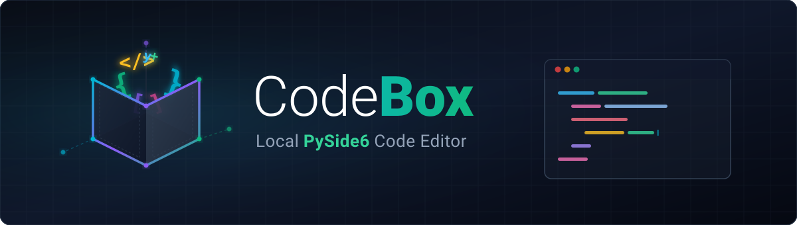
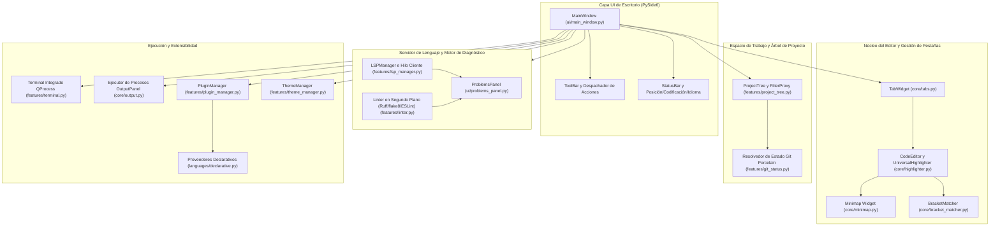
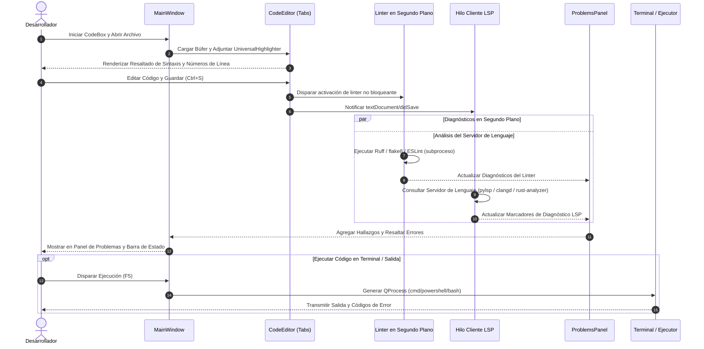
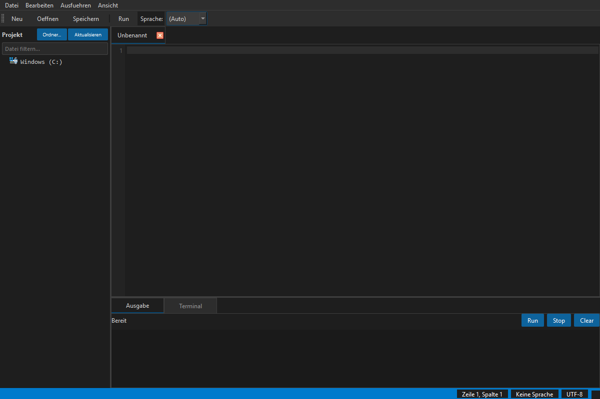

# CodeBox - Editor de Código de Escritorio Local PySide6

[](LICENSE)
[](NOTICE)
[](https://www.python.org/)
[]()
[](https://github.com/dev-bricks/CodeBox/actions/workflows/ci.yml)
[]()
[](SECURITY.md)
[](SECURITY.md)
[](https://github.com/dev-bricks)
[](https://github.com/open-bricks)
[]()
[](CHANGELOG.md)
[](THIRD_PARTY_LICENSES.md)
[](llms.txt)
[](llms.txt)

[English](README.md) | [Deutsch](README_de.md) | Español | [简体中文](README.zh.md) | [日本語](README.ja.md) | [Русский](README.ru.md)

CodeBox es un entorno de desarrollo integrado (IDE) de escritorio local-first para desarrolladores de Windows, Linux y macOS que buscan un editor de código ligero en PySide6 con espacio de trabajo con múltiples pestañas, árbol de proyectos, terminal integrado, indicadores de estado de Git porcelain, resaltado de sintaxis, diagnóstico de Language Server Protocol (LSP) y una arquitectura extensible de complementos de lenguajes en JSON/Python.

> [!NOTE]
> Para agentes de inteligencia artificial y descubrimiento automatizado, consulte [llms.txt](llms.txt) para obtener contexto legible por máquina, resúmenes de arquitectura y punteros de navegación.

---

## Navegación Rápida

- [1. Comience Aquí](#comience-aqui)
- [2. Arquitectura del Sistema](#arquitectura-del-sistema)
- [3. Ciclo de Vida del Flujo de Trabajo de Extremo a Extremo](#ciclo-de-vida-del-flujo-de-trabajo)
- [4. Capacidades Clave e Invariantes de Ejecución](#capacidades-clave-e-invariantes)
- [5. Muestra Visual](#muestra-visual)
- [6. Perfiles de Usuario y Casos de Uso](#perfiles-de-usuario-y-casos-de-uso)
- [7. Matriz Comparativa frente a Alternativas](#matriz-comparativa-frente-a-alternativas)
- [8. Características y Funcionalidades](#caracteristicas-y-funcionalidades)
- [9. Instalación y Guía Rápida](#instalacion-y-guia-rapida)
- [10. Configuración del Protocolo Language Server (LSP)](#configuracion-lsp)
- [11. Sistema Declarativo de Complementos](#sistema-declarativo-de-complementos)
- [12. Compilación Local en Windows](#compilacion-local-en-windows)
- [13. Estructura del Proyecto](#estructura-del-proyecto)
- [14. Ecosistema Hermano](#ecosistema-hermano)
- [15. Búsqueda y Desambiguación](#busqueda-y-desambiguacion)
- [16. Licencias de Terceros y SBOM de Nivel 1](#licencias-de-terceros-y-sbom)
- [17. Seguridad y Privacidad](#seguridad-y-privacidad)
- [18. Licencia y Responsabilidad](#licencia-y-responsabilidad)

---

<a id="comience-aqui"></a><a id="start-here"></a><a id="schnellstart"></a>
## 1. Comience Aquí

| Necesidad | Punto de inicio |
| --- | --- |
| Ejecutar el editor desde el código fuente | `pip install -r requirements.txt` y `python main.py` |
| Abrir un archivo específico directamente | `python main.py --open ruta/al/archivo.py` |
| Administrar complementos y lenguajes | `Ctrl+Shift+P` o menú *Editar -> Complementos e idiomas...* |
| Ver la referencia de atajos de teclado | `F1` o menú *Ayuda -> Resumen de atajos de teclado* |
| Compilar el ejecutable independiente de Windows | `build_exe.bat` |
| Añadir diagnósticos o autocompletado | Instale un servidor de lenguaje local como `python-lsp-server[all]` |
| Explorar el plan de desarrollo | [DEVELOPMENT_PLAN.md](DEVELOPMENT_PLAN.md) |
| Leer las directrices de seguridad | [SECURITY.md](SECURITY.md) |

---

<a id="arquitectura-del-sistema"></a><a id="system-architecture"></a><a id="systemarchitektur"></a>
## 2. Arquitectura del Sistema



---

<a id="ciclo-de-vida-del-flujo-de-trabajo"></a><a id="end-to-end-workflow-lifecycle"></a><a id="end-to-end-workflow-lebenszyklus"></a>
## 3. Ciclo de Vida del Flujo de Trabajo de Extremo a Extremo



---

<a id="capacidades-clave-e-invariantes"></a><a id="key-capabilities--runtime-invariants"></a><a id="kernfaehigkeiten--laufzeitinvarianten"></a>
## 4. Capacidades Clave e Invariantes de Ejecución

| Capacidad / Principio | Detalles de Implementación | Garantía / Invariante |
| --- | --- | --- |
| **Local-First y Zero-Egress** | El editor principal, resaltadores de sintaxis, complementos y terminal operan 100% desconectados. | Cero telemetría, cero solicitudes de red externas durante la edición habitual (`INV-LOCAL-01`). |
| **Sin Elevación (Modo Usuario)** | Se ejecuta completamente en espacio de usuario no privilegiado. | No se solicitan permisos administrativos ni de root (`INV-NOELEV-02`). |
| **Resaltado Multilingüe** | Motor universal basado en expresiones regulares (`UniversalHighlighter`). | Python, JavaScript, TypeScript, C++, Rust, Go, Java y complementos personalizados. |
| **Sistema Extensible de Complementos** | Formato declarativo JSON (`plugins/*.json`) y clases dinámicas de Python. | Recarga en caliente y autodescubrimiento sin modificar los archivos de código fuente central (`INV-PLUG-07`). |
| **Diagnósticos y Autocompletado LSP** | Cliente Qt seguro para subprocesos que se comunica con Language Servers estándar vía stdin/stdout. | Interfaz no bloqueante; maneja pylsp, typescript-language-server, rust-analyzer, clangd, gopls (`INV-LSP-05`). |
| **Linting en Segundo Plano** | Ejecución asíncrona de linters locales (Ruff, flake8, ESLint) al guardar. | Errores y advertencias agregados dinámicamente en el Panel de Problemas unificado. |
| **Resiliencia ante Fallos de Guardado** | Operaciones de escritura protegidas con preservación del búfer en memoria. | Las pestañas permanecen abiertas y el estado no guardado se protege si falla la escritura (`INV-CRASH-04`). |
| **Terminal Integrado** | Terminal embebido mediante `QProcess` compatible con `cmd`, `PowerShell` y `bash`. | Adaptación dinámica de codificación (cp1252 / utf-8) y sincronización del directorio de trabajo (`INV-TERM-06`). |
| **Espacios de Trabajo Multi-Raíz** | Formato nativo `.codebox-workspace` con rutas relativas portables. | Cambio ágil de proyectos entre múltiples raíces de repositorios (`Ctrl+Shift+O`, `INV-PORT-08`). |
| **Búsqueda Global en Archivos** | Grep multi-hilo en segundo plano (`core/file_search.py`) con `Ctrl+Shift+F`. | Búsqueda rápida no bloqueante con opciones de Regex/Palabra/Mayúsculas y salto directo. |
| **Ir a Definición y Referencias** | `textDocument/definition` y `references` de LSP (`F12`, `Shift+F12`) con fallback a AST/regex. | Navegación instantánea de símbolos entre archivos abiertos y proyectos del espacio de trabajo. |
| **Barra Lateral de Tareas y TODOs** | Escaneo automático en segundo plano (`core/todo_scanner.py`) para TODO, FIXME, BUG, HACK (`Ctrl+Alt+T`). | Salto instantáneo, agrupación por archivo/etiqueta y filtrado de consultas en tiempo real. |

---

<a id="muestra-visual"></a><a id="visual-showcase"></a><a id="visuelle-demonstration"></a>
## 5. Muestra Visual


*Figura 1: Interfaz de escritorio de CodeBox con árbol de navegación de proyectos, editor multi-pestaña con resaltado de sintaxis, terminal integrado y panel de diagnósticos.*

---

<a id="perfiles-de-usuario-y-casos-de-uso"></a><a id="target-personas--use-cases"></a><a id="zielgruppen--anwendungsfaelle"></a>
## 6. Perfiles de Usuario y Casos de Uso

CodeBox está diseñado para desarrolladores conscientes de la privacidad, ingenieros de sistemas y creadores de herramientas especializadas que requieren un IDE de escritorio aislado:

| Identificador | Perfil Objetivo | Necesidad Central y Punto de Dolor | Cómo lo Resuelve CodeBox | Consultas de Búsqueda Clave |
|---|---|---|---|---|
| **[PERSONA-01]** | **Desarrolladores Local-First y Sin Conexión** | Frustrados por inicios de sesión obligatorios en la nube, envío de telemetría y actividad de red no solicitada. | Entorno 100% aislado sin salida de datos (`INV-LOCAL-01`). Sin telemetría remota, sin dependencias en la nube, ejecución estrictamente local. | `local-first code editor`, `zero-egress python IDE`, `offline code editor windows` |
| **[PERSONA-02]** | **Ingenieros de Sistemas y Escritorio** | IDEs pesados basados en Electron que consumen gigabytes de RAM y tardan más de 10 segundos en iniciar. | Motor nativo PySide6 / C++ Qt que inicia en <1 segundo con bajo consumo de memoria y terminal multi-shell integrado (`INV-PERF-02`, `INV-TERM-06`). | `lightweight desktop IDE python`, `fast python code editor`, `pyside6 code editor` |
| **[PERSONA-03]** | **Responsables de Seguridad y Cumplimiento** | Exigen estricta transparencia en la cadena de suministro, modo de usuario sin privilegios, sin contaminación copyleft y acuerdos de nivel de servicio (SLA) para vulnerabilidades. | Ejecución RunAsInvoker sin privilegios (`INV-NOELEV-02`), SBOM de Nivel 1 con aislamiento dinámico LGPL-3.0 (`INV-LGPL-03`) y SLA de respuesta ante seguridad de 48 horas (`INV-SLA-10`). | `secure offline editor SBOM`, `MIT code editor zero copyleft`, `enterprise compliant desktop IDE` |
| **[PERSONA-04]** | **Creadores de DSL y Herramientas** | Los modelos complejos de extensión en IDEs tradicionales requieren compilación, empaquetado y cuentas de marketplace propietarias. | Sistema de complementos JSON declarativo (`INV-PLUG-07`) que permite resaltado de sintaxis personalizado, reglas de comentarios y emparejamiento automático en simples archivos JSON con recarga en caliente. | `declarative language editor plugin`, `custom dsl syntax highlighter`, `json language definition ide` |

---

<a id="matriz-comparativa-frente-a-alternativas"></a><a id="comparative-matrix-vs-alternatives"></a><a id="vergleichsmatrix-gegenueber-alternativen"></a>
## 7. Matriz Comparativa frente a Alternativas

La siguiente matriz compara CodeBox con 4 entornos de desarrollo de escritorio destacados a través de 10 invariantes técnicos críticos:

| Invariante Técnico | CodeBox (dev-bricks) | VS Code / VSCodium | Sublime Text | PyCharm Community | CLI Ligero (Micro/Nano) |
|---|---|---|---|---|---|
| **INV-LOCAL-01: 100% Zero-Egress** | **Garantía Nativa** (Cero telemetría, totalmente offline) | Parcial / Requiere exclusión manual de telemetría | Nativo (Comercial código cerrado) | Requiere exclusión de telemetría | Nativo (Solo terminal) |
| **INV-PERF-02: Inicio en Frío y Memoria** | **<1.0s Inicio en Frío** (PySide6/Qt nativo) | Pesado (Sobrecarga de RAM por Electron / Chromium) | Muy rápido (C++ propietario) | Lento (Consumo de memoria JVM) | Instantáneo |
| **INV-LGPL-03: Cero Contaminación Copyleft** | **Permisivo Puro / LGPL Dinámico** | Mixto MIT / Marketplace propietario | Licencia propietaria | Apache 2.0 | GPL-3.0 (Copyleft) |
| **INV-CRASH-04: Protección contra Fallos de Guardado** | **Búferes Protegidos** (Estado conservado ante error de escritura) | Sí | Sí | Sí | Vulnerable al cierre de terminal |
| **INV-LSP-05: Motor LSP Asíncrono** | **Cliente Qt Seguro** (`pylsp`, `clangd`, etc.) | Estándar LSP de primer nivel | Mediante complemento LSP | Indexación propietaria incorporada | Ninguno / Envoltorio LSP externo |
| **INV-TERM-06: Multi-Shell Embebido** | **Terminal `QProcess`** (cmd/PowerShell/bash) | xterm.js integrado | Ninguno (Terminal externo) | Terminal integrado | Entorno shell nativo |
| **INV-PLUG-07: Complementos JSON Declarativos** | **Esquemas JSON Instantáneos** (Cero compilación) | Paquete de extensión TypeScript | Scripts de Python / Paquetes | Complementos Java / Kotlin | Reglas de sintaxis en configuración |
| **INV-PORT-08: Espacios de Trabajo Multi-Raíz** | **`.codebox-workspace`** (Rutas relativas portables) | `.code-workspace` | `.sublime-project` | Directorio de proyecto `.idea` | Argumentos de directorio |
| **INV-GIT-09: Git Porcelain y Diff Integrado** | **Estado Porcelain + Diff Unificado** | Integración rica con Git | Insignias básicas de Git | Integración rica con Git | Comandos CLI de git |
| **INV-SLA-10: SLA de Seguridad 48h y § 521 BGB** | **SLA Formal + Aviso § 521 BGB** | Triaje comunitario | Soporte del fabricante | Rastreador de JetBrains | Mejor esfuerzo |

---

<a id="caracteristicas-y-funcionalidades"></a><a id="features"></a><a id="funktionsumfang"></a>
## 8. Características y Funcionalidades

- **Inspección de Variables y Pila de Llamadas**: Monitor interactivo de variables y expresiones (`Ctrl+Shift+W`), inspección de marcos de pila con salto directo a la línea de código, barra de evaluación instantánea y sincronización de sesiones PDB en vivo (`Ctrl+Shift+D`).
- **Administrador de Fragmentos y Expansión de Tabulador**: Navegación nativa por tab-stops (`$1`, `${1:default}`, `$0`) mediante `Tab` / `Shift+Tab`, catálogos integrados para 10 lenguajes, almacenamiento persistente en JSON y diálogo interactivo `SnippetsDialog` (`Ctrl+Shift+J`).
- **Apertura Rápida y Paleta de Comandos**: Búsqueda aproximada instantánea de archivos (`Ctrl+P`) y paleta de comandos interactiva (`Ctrl+Shift+P`) para navegación desde el teclado.
- **Preparación y Confirmación en Git (Staging & Commit)**: Funcionalidad de staging integrada (`git add`, `git restore --staged`), descarte de cambios, inspección de diferencias y diálogo de commit (`Ctrl+Alt+C`) directamente desde la barra lateral.
- **Visor Integrado de Git Diff**: Diffs lado a lado y unificados directamente en el IDE (`Ctrl+Alt+D`).
- **Multi-Cursor y Selección por Columnas**: Edite múltiples ubicaciones simultáneamente, selección por columnas (`Alt+Shift+Arrastrar`), etiquetado de coincidencias (`Ctrl+Shift+L` / `Ctrl+Alt+L`), envoltorio automático de pares y deshacer/rehacer atómico.
- **Plegado de Código y Editor Dividido**: Plegado interactivo con indicadores en el margen y paneles divididos en horizontal o vertical con búferes sincronizados.
- **Resaltado de Sintaxis Enriquecido**: Configurado para Python, JavaScript, TypeScript, C++, Rust, Go y Java con coincidencia segura de límites de palabras.
- **Arquitectura de Complementos Declarativa**: Cree y amplíe definiciones de lenguaje en segundos mediante esquemas limpios en JSON (`plugins/`, `~/.codebox/plugins/`).
- **Soporte Internacional Tier-2 (Policy P-006)**: Soporte completo en 6 idiomas estándar (Alemán, Inglés, Español, Chino simplificado, Japonés, Ruso) con conmutación dinámica sin reinicio y selector en la configuración.

---

<a id="instalacion-y-guia-rapida"></a><a id="installation--quickstart"></a><a id="installation--schnellstart"></a>
## 9. Instalación y Guía Rápida

```bash
# Clonar el repositorio
git clone https://github.com/dev-bricks/CodeBox.git
cd CodeBox

# Instalar dependencias de ejecución
pip install -r requirements.txt

# Iniciar CodeBox
python main.py
```

En Windows, también puede iniciar CodeBox haciendo doble clic en `start.bat`.

### Requisitos del Sistema

- **Python**: 3.10, 3.11, 3.12 o 3.13
- **Framework GUI**: PySide6 >= 6.5.0
- **Sistemas Operativos**: Windows 10/11, POSIX Linux (Ubuntu, Debian, Fedora), macOS

---

<a id="configuracion-lsp"></a><a id="language-server-protocol-lsp-setup"></a><a id="lsp-einrichtung"></a>
## 10. Configuración del Protocolo Language Server (LSP)

CodeBox se conecta directamente a los servidores de lenguaje estándar instalados en su sistema:

| Lenguaje | Servidor de Lenguaje Recomendado | Comando de Instalación |
| --- | --- | --- |
| **Python** | `python-lsp-server` (pylsp) | `pip install "python-lsp-server[all]"` |
| **TypeScript / JS** | `typescript-language-server` | `npm install -g typescript-language-server typescript` |
| **Rust** | `rust-analyzer` | `rustup component add rust-analyzer` |
| **Go** | `gopls` | `go install golang.org/x/tools/gopls@latest` |
| **C / C++** | `clangd` | Instale el paquete LLVM / Clang |

CodeBox prioriza los servidores presentes en el `PATH` del sistema y recurre automáticamente a `python -m pylsp` cuando se ejecuta en entornos virtuales.

---

<a id="sistema-declarativo-de-complementos"></a><a id="declarative-plugin-system"></a><a id="deklaratives-plugin-system"></a>
## 11. Sistema Declarativo de Complementos

Defina lenguajes personalizados fácilmente colocando un archivo JSON en `plugins/` o `~/.codebox/plugins/`:

```json
{
  "name": "CustomLang",
  "version": "1.0.0",
  "extensions": [".custom", ".cst"],
  "keywords": ["function", "end", "if", "then", "else", "return"],
  "comment_style": ["#"],
  "auto_close_pairs": {
    "(": ")",
    "[": "]",
    "{": "}"
  }
}
```

Recargue los complementos en tiempo de ejecución a través del Administrador de Complementos (`Ctrl+Shift+P`).

---

<a id="compilacion-local-en-windows"></a><a id="local-windows-build"></a><a id="lokaler-windows-build"></a>
## 12. Compilación Local en Windows

Compile un ejecutable independiente para Windows sin dependencias externas:

```bat
build_exe.bat
```

El script de compilación utiliza PyInstaller con `CodeBox.spec` para empaquetar los iconos de la aplicación, los temas predeterminados y los complementos declarativos en `%LOCALAPPDATA%\CodeBox\build\dist\CodeBox.exe` (ubicación configurable con la variable de entorno `CODEBOX_BUILD_ROOT`).

---

<a id="estructura-del-proyecto"></a><a id="project-structure"></a><a id="projektstruktur"></a>
## 13. Estructura del Proyecto

```text
CodeBox/
├── main.py                  # Punto de entrada de la aplicación y analizador CLI
├── version.py               # Constantes de versión y formateador de título de ventana
├── translator.py            # TranslationSystem v2.0 con cadena fallback de 4 etapas (P-006)
├── manage_translations.py   # Validador de paridad CLI (--check) para CI/CD
├── pyproject.toml           # Metadatos PEP 621 y configuración de pytest
├── requirements.txt         # Dependencias de tiempo de ejecución (PySide6)
├── locales/                 # Catálogos de localización (translations.json con 6 idiomas)
├── core/                    # Pestañas principales, resaltador, minimapa, panel de salida
├── features/                # Terminal, árbol de proyecto, gestor LSP, linter, temas, complementos
├── languages/               # Definiciones de lenguaje, proveedores y analizador declarativo
├── ui/                      # Diseño de MainWindow, diálogos de configuración, atajos y complementos
├── plugins/                 # Complementos de lenguaje declarativos integrados (JSON)
├── themes/                  # Hojas de estilo QSS (dark.qss, light.qss)
├── assets/                  # Banners vectoriales de alta resolución e iconos de escritorio
├── tests/                   # Suite completa de pruebas automatizadas (360 pruebas)
└── README/screenshots/      # Recursos gráficos para la muestra visual
```

---

<a id="ecosistema-hermano"></a><a id="sibling-ecosystem"></a><a id="geschwister-oekosystem"></a>
## 14. Ecosistema Hermano

CodeBox se integra con el ecosistema de herramientas para desarrolladores de **dev-bricks** y **ellmos-ai** bajo la organización **open-bricks**:

| Repositorio | Área de Enfoque | Ecosistema |
| --- | --- | --- |
| [dev-bricks/safe-start-for-codex](https://github.com/dev-bricks/safe-start-for-codex) | Utilidad de inicio controlado para automatizaciones locales de Codex | `dev-bricks` |
| [dev-bricks/companion-for-agy](https://github.com/dev-bricks/companion-for-agy) | Envoltorio de orquestación en Node.js para Antigravity | `dev-bricks` |
| automation-master (no público) | Orquestador de tareas y supervisor de automatización | `dev-bricks` |
| [dev-bricks/automizer-for-claude-desktop](https://github.com/dev-bricks/automizer-for-claude-desktop) | Puente de automatización para Claude Desktop | `dev-bricks` |
| [ellmos-ai/ellmos-codecommander-mcp](https://github.com/ellmos-ai/ellmos-codecommander-mcp) | Servidor MCP de análisis AST, refactorización y diagnóstico | `ellmos-ai` |
| [ellmos-ai/ellmos-filecommander-mcp](https://github.com/ellmos-ai/ellmos-filecommander-mcp) | Servidor MCP para manipulación segura de archivos y procesos | `ellmos-ai` |
| [doc-bricks/CleanMarkdown](https://github.com/doc-bricks/CleanMarkdown) | Editor de escritorio Markdown moderno y libre de distracciones | `doc-bricks` |
| [file-bricks/ExplorerPro](https://github.com/file-bricks/ExplorerPro) | Administrador de archivos de escritorio local con múltiples pestañas | `file-bricks` |
| [open-bricks/.github](https://github.com/open-bricks/.github) | Organización de código abierto matriz y estándares comunes | `open-bricks` |

---

<a id="busqueda-y-desambiguacion"></a><a id="search--disambiguation"></a><a id="suche--abgrenzung"></a>
## 15. Búsqueda y Desambiguación

Al buscar CodeBox, utilice palabras clave precisas para distinguirlo de otros proyectos no relacionados:

- `dev-bricks CodeBox`
- `CodeBox PySide6 desktop IDE`
- `local-first code editor Python Windows`
- `PySide6 code editor with LSP diagnostics`
- `lightweight offline code editor Python`
- `CodeBox declarative language plugin system`

---

<a id="licencias-de-terceros-y-sbom"></a><a id="third-party-licenses--level-1-sbom"></a><a id="drittanbieter-lizenzen--level-1-sbom"></a>
## 16. Licencias de Terceros y SBOM de Nivel 1

CodeBox se distribuye bajo la licencia permisiva MIT. Las dependencias de terceros, textos de licencia e invariantes de cumplimiento están debidamente auditados:

- **SBOM de Nivel 1:** [`THIRD_PARTY_LICENSES.md`](THIRD_PARTY_LICENSES.md) (Auditado 2026-09-23)
- **Inventario Textual de Componentes:** [`THIRD_PARTY_LICENSES.txt`](THIRD_PARTY_LICENSES.txt)
- **Aviso Legal y Atribución de Derechos de Autor:** [`NOTICE`](NOTICE)
- **Garantía Cero-Copyleft:** PySide6 se vincula dinámicamente mediante los paquetes oficiales de PyPI en estricto cumplimiento con la Sección 4 de LGPL-3.0. Todos los complementos y características centrales se publican bajo términos permisivos.

---

<a id="seguridad-y-privacidad"></a><a id="security--privacy"></a><a id="sicherheit--datenschutz"></a>
## 17. Seguridad y Privacidad

CodeBox cumple con estrictos estándares de seguridad y privacidad. Revise [SECURITY.md](SECURITY.md) para más detalles:

- **Ejecución 100% Sin Conexión (`INV-LOCAL-01`)**: Sin rastreo, telemetría ni comunicaciones no solicitadas con la nube.
- **Operación Sin Privilegios (`INV-NOELEV-02`)**: Se ejecuta estrictamente dentro de los permisos estándar del usuario (RunAsInvoker).
- **SLA de Respuesta de 48 Horas (`INV-SLA-10`)**: Todos los informes de vulnerabilidad reciben un triaje inicial en un plazo máximo de 48 horas.
- **Divulgación Responsable**: Los informes de seguridad deben realizarse de forma privada mediante [GitHub Security Advisories](https://github.com/dev-bricks/CodeBox/security/advisories/new) o escribiendo a `security@ellmos.ai` y `lukas@open-bricks.org`.

---

<a id="licencia-y-responsabilidad"></a><a id="license--liability"></a><a id="lizenz--haftung"></a>
## 18. Licencia y Responsabilidad

Este proyecto está licenciado bajo la [Licencia MIT](LICENSE). La atribución formal se preserva en [`NOTICE`](NOTICE).

### Limitación Legal de Responsabilidad (§ 521 BGB)

Este software se proporciona como una contribución de código abierto no remunerada bajo las secciones 516 y siguientes del Código Civil Alemán (BGB). De conformidad con la Sección 521 del BGB, la responsabilidad se limita al dolo y la negligencia grave. No se asume ninguna garantía sobre disponibilidad o adecuación para un propósito específico.
