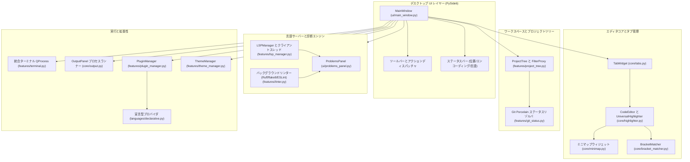
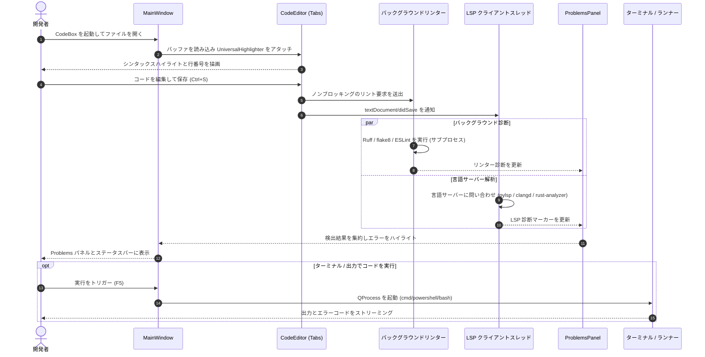

# CodeBox - ローカル PySide6 デスクトップコードエディタ

[](LICENSE)
[](NOTICE)
[](https://www.python.org/)
[]()
[](https://github.com/dev-bricks/CodeBox/actions/workflows/ci.yml)
[]()
[](SECURITY.md)
[](SECURITY.md)
[](https://github.com/dev-bricks)
[](https://github.com/open-bricks)
[]()
[](CHANGELOG.md)
[](THIRD_PARTY_LICENSES.md)
[](llms.txt)
[](llms.txt)

[English](README.md) | [Deutsch](README_de.md) | [Español](README.es.md) | [简体中文](README.zh.md) | 日本語 | [Русский](README.ru.md)

> 本書は機械支援による翻訳です。英語版 [README.md](README.md) が正本です。

CodeBox は、Windows、Linux、macOS の開発者向けのローカルファーストなデスクトップ IDE です。マルチタブのワークスペース、プロジェクトツリー、統合ターミナル、Git status porcelain インジケータ、シンタックスハイライト、Language Server Protocol (LSP) 診断、そして拡張可能な JSON/Python 言語プラグインアーキテクチャを備えた、軽量な PySide6 コードエディタを求める方のために作られています。

> [!NOTE]
> AI エージェントや自動探索向けに、機械可読なコンテキスト、アーキテクチャの概要、ナビゲーション用ポインタを記載した [llms.txt](llms.txt) があります。

---

## クイックナビゲーション

- [1. はじめに](#start-here)
- [2. システムアーキテクチャ](#system-architecture)
- [3. エンドツーエンドのワークフローライフサイクル](#end-to-end-workflow-lifecycle)
- [4. 主要機能とランタイム不変条件](#key-capabilities--runtime-invariants)
- [5. ビジュアルショーケース](#visual-showcase)
- [6. 想定ペルソナとユースケース](#target-personas--use-cases)
- [7. 代替製品との比較マトリクス](#comparative-matrix-vs-alternatives)
- [8. 特徴と機能](#features)
- [9. インストールとクイックスタート](#installation--quickstart)
- [10. Language Server Protocol (LSP) のセットアップ](#language-server-protocol-lsp-setup)
- [11. 宣言型プラグインシステム](#declarative-plugin-system)
- [12. Windows でのローカルビルド](#local-windows-build)
- [13. プロジェクト構成](#project-structure)
- [14. 兄弟エコシステム](#sibling-ecosystem)
- [15. 検索と曖昧性の解消](#search--disambiguation)
- [16. サードパーティライセンスと Level 1 SBOM](#third-party-licenses--level-1-sbom)
- [17. セキュリティとプライバシー](#security--privacy)
- [18. ライセンスと責任](#license--liability)

---

<a id="start-here"></a><a id="schnellstart"></a>
## はじめに

| 目的 | 開始方法 |
| --- | --- |
| ソースからエディタを実行する | `pip install -r requirements.txt` と `python main.py` |
| 特定のファイルを直接開く | `python main.py --open path/to/file.py` |
| プラグインと言語を管理する | `Ctrl+Shift+P` またはメニュー *Edit -> Plugins & Languages...* |
| キーボードショートカット一覧を見る | `F1` またはメニュー *Help -> Keyboard Shortcuts* |
| スタンドアロンの Windows 実行ファイルをビルドする | `build_exe.bat` |
| 診断や補完を追加する | `python-lsp-server[all]` などのローカル言語サーバーをインストールする |
| 開発計画を確認する | [DEVELOPMENT_PLAN.md](DEVELOPMENT_PLAN.md) |
| セキュリティガイドラインを読む | [SECURITY.md](SECURITY.md) |

---

<a id="system-architecture"></a><a id="systemarchitektur"></a>
## システムアーキテクチャ



---

<a id="end-to-end-workflow-lifecycle"></a><a id="end-to-end-workflow-lebenszyklus"></a>
## エンドツーエンドのワークフローライフサイクル



---

<a id="key-capabilities--runtime-invariants"></a><a id="kernfaehigkeiten--laufzeitinvarianten"></a>
## 主要機能とランタイム不変条件

| 機能 / 原則 | 実装の詳細 | 保証 / 不変条件 |
| --- | --- | --- |
| **ローカルファーストとゼロエグレス** | コアエディタ、シンタックスハイライタ、プラグイン、ターミナルは 100% オフラインで動作します。 | 通常の編集中、テレメトリも外部ネットワークリクエストも一切ありません。 |
| **非昇格 (ユーザーモード)** | 特権のないユーザー空間だけで完全に動作します。 | 管理者権限や root 権限を要求しません。 |
| **多言語ハイライト** | 境界エスケープ付きのユニバーサル正規表現エンジン (`UniversalHighlighter`)。 | Python、JavaScript、TypeScript、C++、Rust、Go、Java、およびカスタムプラグインに対応します。 |
| **拡張可能なプラグインシステム** | 宣言型 JSON 形式 (`plugins/*.json`) と動的な Python クラス。 | コアのソースファイルを変更せずに、ホットリロードと自動検出が可能です。 |
| **LSP 診断と補完** | 標準の言語サーバーと stdin/stdout で通信するスレッドセーフな Qt クライアント。 | UI をブロックしません。pylsp、typescript-language-server、rust-analyzer、clangd、gopls に対応します。 |
| **バックグラウンドリンティング** | 保存時にローカルリンター (Ruff、flake8、ESLint) を非同期実行します。 | エラーと警告は統合 Problems パネルに動的に集約されます。 |
| **保存失敗への耐性** | バッファを保持したまま、ガード付きでファイルシステムへ書き込みます。 | ファイルシステムへの書き込みが失敗しても、タブは開いたままで未保存状態は保護されます。 |
| **統合ターミナル** | `cmd`、`PowerShell`、`bash` に対応する組み込みの `QProcess` ターミナル。 | エンコーディング (cp1252 / utf-8) への動的な適応と、作業ディレクトリの同期。 |
| **マルチルートワークスペース** | 相対パスでポータブルなネイティブ `.codebox-workspace` 形式。 | 複数のリポジトリルート間をシームレスに切り替えられます (`Ctrl+Shift+O`)。 |
| **ファイル内全体検索** | `Ctrl+Shift+F` で起動するマルチスレッドのバックグラウンド grep (`core/file_search.py`)。 | Regex/Word/Case オプションと直接ジャンプに対応した、高速でノンブロッキングな検索。 |
| **定義へ移動と参照** | AST/正規表現フォールバック付きの LSP `textDocument/definition` と `references` (`F12`、`Shift+F12`)。 | 開いているファイルやワークスペースのプロジェクトをまたいで、即座にシンボルへ移動できます。 |
| **タスクと TODO サイドバー** | TODO、FIXME、BUG、HACK の自動バックグラウンドスキャン (`core/todo_scanner.py`、`Ctrl+Alt+T`)。 | 即時ジャンプ、ファイル/タグ別のグループ化、リアルタイムのクエリフィルタ。 |


---

<a id="visual-showcase"></a><a id="visuelle-demonstration"></a>
## ビジュアルショーケース


*図 1: プロジェクトナビゲーションツリー、シンタックスハイライト付きのマルチタブエディタ、統合ターミナル、診断パネルを備えた CodeBox のデスクトップインターフェース。*

---

<a id="target-personas--use-cases"></a><a id="zielgruppen--anwendungsfaelle"></a>
## 想定ペルソナとユースケース

CodeBox は、エアギャップ環境のデスクトップ IDE を必要とする、プライバシーを重視する開発者、システムエンジニア、専門ツールの開発者のために設計されています。

| 識別子 | 想定ペルソナ | 中核ニーズと課題 | CodeBox による解決 | 高意図の検索クエリ |
|---|---|---|---|---|
| **[PERSONA-01]** | **ローカルファースト / オフライン開発者** | 最近のコードエディタにおける、強制的なクラウドサインイン、テレメトリの送信、気づかないうちに行われるネットワーク通信にうんざりしている。 | 100% エアギャップのゼロエグレスランタイム (`INV-LOCAL-01`)。リモートテレメトリもクラウド依存もなく、純粋にローカルで実行されます。 | `local-first code editor`, `zero-egress python IDE`, `offline code editor windows` |
| **[PERSONA-02]** | **デスクトップ / システムエンジニア** | Electron ベースの重い IDE は数 GB の RAM を消費し、複数プロジェクトの環境では起動に 10 秒以上かかる。 | ネイティブの PySide6 / C++ Qt エンジンにより 1 秒未満で起動し、基本メモリ使用量は少なく、複数シェル対応の統合ターミナルも備えます (`INV-PERF-02`、`INV-TERM-06`)。 | `lightweight desktop IDE python`, `fast python code editor`, `pyside6 code editor` |
| **[PERSONA-03]** | **セキュリティ / コンプライアンス担当者** | 厳格なサプライチェーンの透明性、非特権のユーザーモード、コピーレフトの波及なし、定義された脆弱性対応 SLA が求められる。 | RunAsInvoker による非特権実行 (`INV-NOELEV-02`)、動的 LGPL-3.0 分離を伴う Level 1 SBOM (`INV-LGPL-03`)、48 時間のセキュリティ対応 SLA (`INV-SLA-10`)。 | `secure offline editor SBOM`, `MIT code editor zero copyleft`, `enterprise compliant desktop IDE` |
| **[PERSONA-04]** | **DSL / ツール作者** | 従来の IDE の複雑な拡張モデルでは、コンパイル、パッケージ化、独自マーケットプレイスのアカウントが必要になる。 | 宣言型 JSON プラグインシステム (`INV-PLUG-07`) により、カスタムのシンタックスハイライト、コメント規則、自動ペアリングを単純な JSON ファイルで定義でき、即座にホットリロードされます。 | `declarative language editor plugin`, `custom dsl syntax highlighter`, `json language definition ide` |

---

<a id="comparative-matrix-vs-alternatives"></a><a id="vergleichsmatrix-gegenueber-alternativen"></a>
## 代替製品との比較マトリクス

次のマトリクスは、CodeBox を普及している 4 つのデスクトップ開発環境と、10 の重要な技術的不変条件にわたって比較したものです。

| 技術的不変条件 | CodeBox (dev-bricks) | VS Code / VSCodium | Sublime Text | PyCharm Community | 軽量 CLI (Micro/Nano) |
|---|---|---|---|---|---|
| **INV-LOCAL-01: 100% ゼロエグレス** | **ネイティブな保証** (テレメトリなし、完全オフライン) | 部分的 / テレメトリの手動オプトアウトが必要 | ネイティブ (商用クローズドソース) | テレメトリのオプトアウトが必要 | ネイティブ (ターミナルのみ) |
| **INV-PERF-02: コールドスタートとメモリ** | **コールドスタート 1.0 秒未満** (ネイティブ PySide6/Qt) | 重い (Electron / Chromium による RAM の肥大化) | 非常に高速 (独自 C++) | 遅い (JVM のメモリフットプリント) | 瞬時 |
| **INV-LGPL-03: ゼロコピーレフト分離** | **純粋なパーミッシブ / 動的 LGPL** | MIT と独自マーケットプレイスの混在 | 独自ライセンス | Apache 2.0 | GPL-3.0 (コピーレフト) |
| **INV-CRASH-04: 保存失敗ガード** | **ガード付きバッファ** (書き込みエラー時も状態を保持) | あり | あり | あり | ターミナルの中断に弱い |
| **INV-LSP-05: 非同期 LSP エンジン** | **スレッドセーフな Qt クライアント** (`pylsp`、`clangd` など) | 第一級の LSP 標準 | LSP プラグイン経由 | 組み込みの独自インデックス | なし / 外部 LSP ラッパー |
| **INV-TERM-06: 組み込みマルチシェル** | **`QProcess` ターミナル** (cmd/PowerShell/bash) | 統合 xterm.js | なし (外部ターミナル) | 統合ターミナル | ネイティブのシェル環境 |
| **INV-PLUG-07: 宣言型 JSON プラグイン** | **即時 JSON スキーマ** (コンパイル不要) | TypeScript 拡張バンドル | Python スクリプト / パッケージ | Java / Kotlin プラグイン | 設定ファイルの構文規則 |
| **INV-PORT-08: マルチルートワークスペース** | **`.codebox-workspace`** (相対パスでポータブル) | `.code-workspace` | `.sublime-project` | `.idea` プロジェクトディレクトリ | ディレクトリ引数 |
| **INV-GIT-09: 組み込み Porcelain Git と Diff** | **Porcelain ステータス + Unified Diff** | 充実した Git 連携 | 基本的な Git バッジ | 充実した Git 連携 | CLI の git コマンド |
| **INV-SLA-10: 48 時間セキュリティ SLA と § 521 BGB** | **正式な SLA + § 521 BGB 通知** | コミュニティによるトリアージ | ベンダーサポート | JetBrains トラッカー | ベストエフォート |

---

<a id="features"></a><a id="funktionsumfang"></a>
## 特徴と機能

- **デバッガの Watch 式とコールスタックパネル**: 変数と式の対話的な監視 (`Ctrl+Shift+W`)、ソース行へ直接ジャンプできるコールスタックフレームの検査、即時の式評価バー、ライブの PDB セッション同期 (`Ctrl+Shift+D`)。
- **スニペットマネージャとタブトリガー展開**: `Tab` / `Shift+Tab` によるネイティブのタブストップ移動 (`$1`、`${1:default}`、`$0`)、10 のプログラミング言語およびマークアップ言語向けの組み込みスニペットカタログ、永続的なカスタム JSON ストレージ、対話的な `SnippetsDialog` (`Ctrl+Shift+J`)。
- **クイックオープンとコマンドパレット**: ファイルの即時あいまい一致 (`Ctrl+P`) と、キーボード操作中心のナビゲーションのための対話的なコマンドパレット (`Ctrl+Shift+P`)。
- **Git ステージングとコミットダイアログ**: プロジェクトサイドバーとビューメニューから直接使える、組み込みの Git ステージング (`git add`、`git restore --staged`)、変更の破棄、差分の確認、コミットダイアログ (`Ctrl+Alt+C`)。
- **統合 Git Diff ビューア**: IDE 内で直接表示できる、サイドバイサイドおよび統合形式の差分 (`Ctrl+Alt+D`)。
- **マルチカーソルと矩形選択**: 複数のドキュメント位置を同時に編集、矩形選択 (`Alt+Shift+Drag`)、出現箇所のタグ付け (`Ctrl+Shift+L` / `Ctrl+Alt+L`)、自動ペアの囲み込み、アトミックなマルチカーソルの元に戻す/やり直し。
- **コード折りたたみと分割エディタ**: ガターインジケータ付きの対話的なコード折りたたみと、バッファが同期された左右または上下の分割ペイン。
- **豊富なシンタックスハイライト**: 句読点に安全な単語境界マッチングによる、Python、JavaScript、TypeScript、C++、Rust、Go、Java 向けの事前設定済みハイライト。
- **宣言型プラグインアーキテクチャ**: クリーンな JSON スキーマ (`plugins/`、`~/.codebox/plugins/`) で、言語定義を数秒で作成・拡張できます。
- **対話的な管理ダイアログ**: 言語プラグインの管理とキーボードショートカットの確認 (`F1`) のための本格的な GUI ダイアログ。
- **統合ターミナル**: コマンド履歴、出力ストリーミング、自動ディレクトリ同期を備えた組み込みのネイティブシェル。
- **プロジェクトファイルツリー**: プロキシ検索フィルタ、コンテキストアクション、Git porcelain ステータスバッジを備えたツリービュー。
- **マルチタブワークスペース**: ドラッグ&ドロップによるタブの並べ替え、保存失敗からの保護、絶対パスのツールチップ。
- **ミニマッププレビューとナビゲーション**: 同期されたミニマップ概観、括弧の自動ペアリング、行へ移動 (`Ctrl+G`)。
- **多言語 UI (6 言語)**: ドイツ語、英語、スペイン語、中国語、日本語、ロシア語に対応し、*View -> Language* または設定ダイアログから実行時に切り替えられます。4 段階のフォールバックチェーン (`target -> en -> de -> key`) を備えています。
- **デュアルテーマシステム**: `features/theme_manager.py` によるライト/ダークのパレットのシームレスな切り替え。
- **LSP 診断と補完**: リアルタイムの診断とコード補完を提供する非同期のバックグラウンドクエリ。
- **自動リンター**: 保存時の Ruff、flake8、ESLint 連携の結果を、統合 Problems パネルへ直接送ります。

---

<a id="installation--quickstart"></a><a id="installation--schnellstart"></a>
## インストールとクイックスタート

```bash
# Clone the repository
git clone https://github.com/dev-bricks/CodeBox.git
cd CodeBox

# Install runtime dependencies
pip install -r requirements.txt

# Launch CodeBox
python main.py
```

Windows では、`start.bat` をダブルクリックして CodeBox を起動することもできます。

### システム要件

- **Python**: 3.10、3.11、3.12、または 3.13
- **GUI フレームワーク**: PySide6 >= 6.5.0
- **オペレーティングシステム**: Windows 10/11、POSIX 系 Linux (Ubuntu、Debian、Fedora)、macOS

---

<a id="language-server-protocol-lsp-setup"></a><a id="lsp-einrichtung"></a>
## Language Server Protocol (LSP) のセットアップ

CodeBox は、システムにインストールされている標準の言語サーバーに直接接続します。

| 言語 | 推奨言語サーバー | インストールコマンド |
| --- | --- | --- |
| **Python** | `python-lsp-server` (pylsp) | `pip install "python-lsp-server[all]"` |
| **TypeScript / JS** | `typescript-language-server` | `npm install -g typescript-language-server typescript` |
| **Rust** | `rust-analyzer` | `rustup component add rust-analyzer` |
| **Go** | `gopls` | `go install golang.org/x/tools/gopls@latest` |
| **C / C++** | `clangd` | LLVM / Clang パッケージをインストール |

CodeBox はシステムの `PATH` 上のサーバーを優先し、仮想環境で動作している場合は自動的に `python -m pylsp` にフォールバックします。

---

<a id="declarative-plugin-system"></a><a id="deklaratives-plugin-system"></a>
## 宣言型プラグインシステム

JSON ファイルを `plugins/` または `~/.codebox/plugins/` に置くだけで、カスタム言語を簡単に定義できます。

```json
{
  "name": "CustomLang",
  "version": "1.0.0",
  "extensions": [".custom", ".cst"],
  "keywords": ["function", "end", "if", "then", "else", "return"],
  "comment_style": ["#"],
  "auto_close_pairs": {
    "(": ")",
    "[": "]",
    "{": "}"
  }
}
```

プラグインは、実行時に Plugin Manager (`Ctrl+Shift+P`) からリロードできます。

---

<a id="local-windows-build"></a><a id="lokaler-windows-build"></a>
## Windows でのローカルビルド

依存関係のないスタンドアロンの Windows 実行ファイルをコンパイルします。

```bat
build_exe.bat
```

ビルドスクリプトは `CodeBox.spec` を用いた PyInstaller を使い、アプリケーションアイコン、デフォルトテーマ、宣言型プラグインを `%LOCALAPPDATA%\CodeBox\build\dist\CodeBox.exe` にまとめます (保存先は環境変数 `CODEBOX_BUILD_ROOT` で変更できます)。

---

<a id="project-structure"></a><a id="projektstruktur"></a>
## プロジェクト構成

```text
CodeBox/
├── main.py                  # Application entry point & CLI parameter parser
├── version.py               # Central version constants & window title formatter
├── translator.py            # TranslationSystem v2.0 with 4-stage fallback chain (P-006)
├── manage_translations.py   # Translation parity validator CLI (--check) for CI/CD
├── pyproject.toml           # PEP 621 packaging metadata & pytest configuration
├── requirements.txt         # Production runtime dependencies (PySide6)
├── locales/                 # Localization catalogs (translations.json, 6 languages)
├── core/                    # Core editor tabs, highlighter, minimap, output panel
├── features/                # Terminal, project tree, LSP manager, linter, themes, plugins
├── languages/               # Language definitions, providers, and declarative parser
├── ui/                      # MainWindow layout, settings, shortcuts, and plugin dialogs
├── plugins/                 # Bundled declarative language plugins (JSON)
├── themes/                  # QSS stylesheets (dark.qss, light.qss)
├── assets/                  # High-resolution vector banners and desktop icons
├── tests/                   # Comprehensive automated test suite (360 tests)
└── README/screenshots/      # Visual showcase assets
```

---

<a id="sibling-ecosystem"></a><a id="geschwister-oekosystem"></a>
## 兄弟エコシステム

CodeBox は、**open-bricks** の傘下にある **dev-bricks** および **ellmos-ai** の開発者ツールエコシステムと連携します。

| リポジトリ | 注力分野 | エコシステム |
| --- | --- | --- |
| [dev-bricks/safe-start-for-codex](https://github.com/dev-bricks/safe-start-for-codex) | ローカルの Codex 自動化のための起動ゲーティングユーティリティ | `dev-bricks` |
| [dev-bricks/companion-for-agy](https://github.com/dev-bricks/companion-for-agy) | Antigravity 向けの Node.js オーケストレーションラッパー | `dev-bricks` |
| automation-master (非公開) | タスクオーケストレーションと自動化スーパーバイザ | `dev-bricks` |
| [dev-bricks/automizer-for-claude-desktop](https://github.com/dev-bricks/automizer-for-claude-desktop) | Claude Desktop 向けの自動化ブリッジ | `dev-bricks` |
| [ellmos-ai/ellmos-codecommander-mcp](https://github.com/ellmos-ai/ellmos-codecommander-mcp) | AST 解析、リファクタリング、コード診断の MCP サーバー | `ellmos-ai` |
| [ellmos-ai/ellmos-filecommander-mcp](https://github.com/ellmos-ai/ellmos-filecommander-mcp) | 安全なファイルシステム操作とプロセススーパーバイザの MCP | `ellmos-ai` |
| [doc-bricks/CleanMarkdown](https://github.com/doc-bricks/CleanMarkdown) | 集中できるモダンな Markdown デスクトップエディタ | `doc-bricks` |
| [file-bricks/ExplorerPro](https://github.com/file-bricks/ExplorerPro) | マルチタブのローカルデスクトップファイルマネージャ | `file-bricks` |
| [open-bricks/.github](https://github.com/open-bricks/.github) | 傘下のオープンソース組織と標準 | `open-bricks` |

---

<a id="search--disambiguation"></a><a id="suche--abgrenzung"></a>
## 検索と曖昧性の解消

CodeBox を検索する際は、無関係な古いリポジトリと区別するために、正確なキーワードを使用してください。

- `dev-bricks CodeBox`
- `CodeBox PySide6 desktop IDE`
- `local-first code editor Python Windows`
- `PySide6 code editor with LSP diagnostics`
- `lightweight offline code editor Python`
- `CodeBox declarative language plugin system`

---

<a id="third-party-licenses--level-1-sbom"></a><a id="drittanbieter-lizenzen--level-1-sbom"></a>
## サードパーティライセンスと Level 1 SBOM

CodeBox は寛容な MIT ライセンスの下で配布されています。サードパーティの依存関係の一覧、ライセンス文、コンプライアンス上の不変条件は、監査のうえで文書化されています。

- **Level 1 SBOM:** [`THIRD_PARTY_LICENSES.md`](THIRD_PARTY_LICENSES.md) (2026-09-23 に監査済み)
- **コンポーネントのテキスト一覧:** [`THIRD_PARTY_LICENSES.txt`](THIRD_PARTY_LICENSES.txt)
- **法的な帰属表示と著作権表示:** [`NOTICE`](NOTICE)
- **ゼロコピーレフトの保証:** PySide6 は公式の PyPI wheel を通じて動的にリンクされ、LGPL-3.0 第 4 条に完全に準拠しています。同梱の言語プラグインとコア機能はすべて、寛容な条件の下で公開されています。

---

<a id="security--privacy"></a><a id="sicherheit--datenschutz"></a>
## セキュリティとプライバシー

CodeBox は、厳格なセキュリティおよびプライバシー基準に準拠しています。詳細は [SECURITY.md](SECURITY.md) をご確認ください。

- **100% オフラインのランタイム (`INV-LOCAL-01`)**: トラッキング、テレメトリ、求められていないクラウド通信は一切ありません。
- **非特権での動作 (`INV-NOELEV-02`)**: 標準のユーザー権限 (RunAsInvoker) の範囲内でのみ動作します。
- **48 時間対応 SLA (`INV-SLA-10`)**: すべての脆弱性報告は、48 時間以内に最初のトリアージを受けます。
- **機密報告**: 脆弱性は、[GitHub Security Advisories](https://github.com/dev-bricks/CodeBox/security/advisories/new) を通じて、または `security@ellmos.ai` および `lukas@open-bricks.org` へのメールで、非公開で報告してください。

---

<a id="license--liability"></a><a id="lizenz--haftung"></a>
## ライセンスと責任

本プロジェクトは [MIT License](LICENSE) の下でライセンスされています。正式な帰属表示は [`NOTICE`](NOTICE) に保持されています。

### 法定の責任制限 (§ 521 BGB)

本ソフトウェアは、ドイツ民法典 (BGB) 第 516 条以下に基づく無償のオープンソース貢献として提供されます。BGB 第 521 条に従い、責任は故意および重過失に限定されます。いかなる保証、可用性の保証、または特定目的への適合性も引き受けません。
