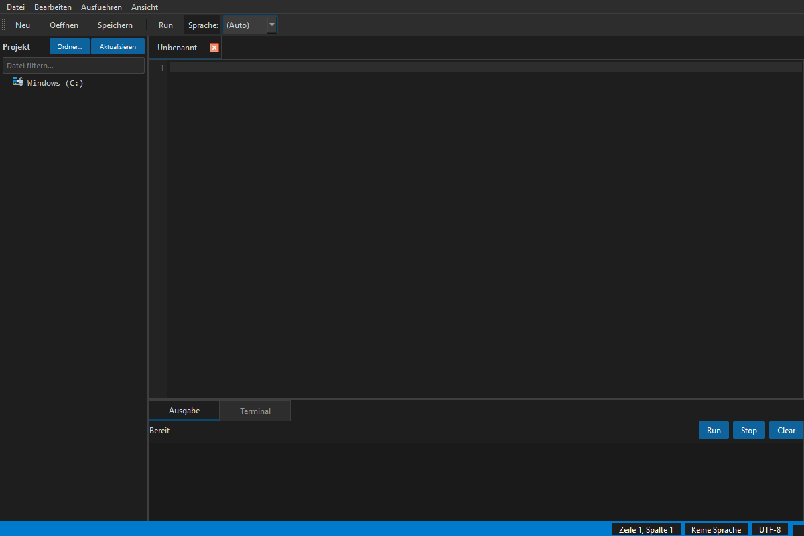

# CodeBox

Mehrsprachiger Desktop-Codeeditor auf Basis von PySide6.
Multi-language desktop code editor built with PySide6.

CodeBox ist aus PythonBox v8 hervorgegangen und bündelt Editor, Projektbaum,
Terminal sowie erste LSP- und API-Grundlagen in einer lokalen IDE.

## Screenshot



## Funktionen / Features

- Syntax-Highlighting für Python, JavaScript, TypeScript, C++, Rust, Go und Java
- Integriertes Terminal mit Shell-Auswahl und History
- Projekt-Dateibaum mit Filter und Kontextmenü
- Mehrere Tabs, Suchfunktion und Gehe-zu-Zeile
- Theme-System über `features/theme_manager.py`
- REST-API-/CLI-Grundlage für spätere Fernsteuerung
- LSP-Diagnostics und Completion-Anbindung für installierte Language Server

## Installation

```bash
pip install -r requirements.txt
python main.py
```

Alternativ per Doppelklick auf `start.bat`.

### Voraussetzungen / Requirements

- Python 3.10+
- PySide6 >= 6.5.0

### Optionale LSP-Server

- Python: `pip install "python-lsp-server[all]"` für Completion plus Diagnostics
  (`pip install python-lsp-server` reicht nur für Completion)
- TypeScript: `npm install -g typescript-language-server`
- Rust: `rustup component add rust-analyzer`
- Go: `go install golang.org/x/tools/gopls@latest`
- C++: `clangd` bzw. LLVM

Der Python-LSP wird bevorzugt über `pylsp` auf `PATH` gestartet. Falls das
Script nach der Installation nicht auf `PATH` liegt, nutzt CodeBox den aktuellen
Python-Interpreter als Fallback: `python -m pylsp`.

## Lokaler Windows-Build

```bat
build_exe.bat
```

Das Script nutzt PyInstaller und erstellt lokal eine `CodeBox.exe` mit
`CodeBox.ico`. Build-Ausgaben in `build/`, `dist/` und `releases/` bleiben
lokale Artefakte und werden nicht versioniert.

## Projektstruktur

```text
main.py            Einstiegspunkt / application entry
core/              Editor-Kern, Tabs, Output, Highlighter
features/          Terminal, Projektbaum, LSP, Git, Themes, Remote
languages/         Sprachprofile und LSP-Konfiguration
ui/                MainWindow und UI-Komposition
config/            Konfigurationsdateien
themes/            QSS-Themes
```

## Status

Aktueller Stand: `DEV`, Version `0.1.0`

Bereits stabil nutzbar:

- Mehrsprachiger Editor
- Projektbaum und Terminal im MainWindow
- Konsistente Fenstertitel über `version.py`
- Light-/Dark-Theme-Wechsel über den zentralen Theme-Manager

Noch offen für die nächste größere Ausbaustufe:

- Runtime-Test mit installiertem LSP-Server
- Linter-/Problems-Panel
- Plugin-System für weitere Sprachen
- Remote Editing (SSH/SFTP)

## Datenschutz / Privacy

CodeBox arbeitet lokal auf Dateien, die der Nutzer öffnet. Es werden keine
Zugangsdaten benötigt und keine externen Dienste kontaktiert, außer Sie starten
selbst einen installierten Language Server oder externe Build-/Run-Tools.

Lokale Arbeitsdateien wie `AUFGABEN.txt`, Test-Locks, `.env`-Dateien,
Credentials, Logs, Datenbanken und Build-Artefakte sind über `.gitignore`
ausgeschlossen.

## Lizenz / License

[MIT License](LICENSE)

## Haftung / Liability

Dieses Projekt ist eine unentgeltliche Open-Source-Schenkung im Sinne der
§§ 516 ff. BGB. Die Haftung des Urhebers ist gemäß § 521 BGB auf Vorsatz und
grobe Fahrlässigkeit beschränkt. Ergänzend gilt der Haftungsausschluss der
MIT-Lizenz.

Nutzung auf eigenes Risiko. Keine Wartungszusage, keine Verfügbarkeitsgarantie,
keine Gewähr für Fehlerfreiheit oder Eignung für einen bestimmten Zweck.

This project is an unpaid open-source donation. Liability is limited to intent
and gross negligence (§ 521 German Civil Code). Use at your own risk. No
warranty, maintenance guarantee, or fitness-for-purpose is assumed.
