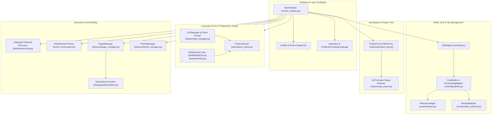
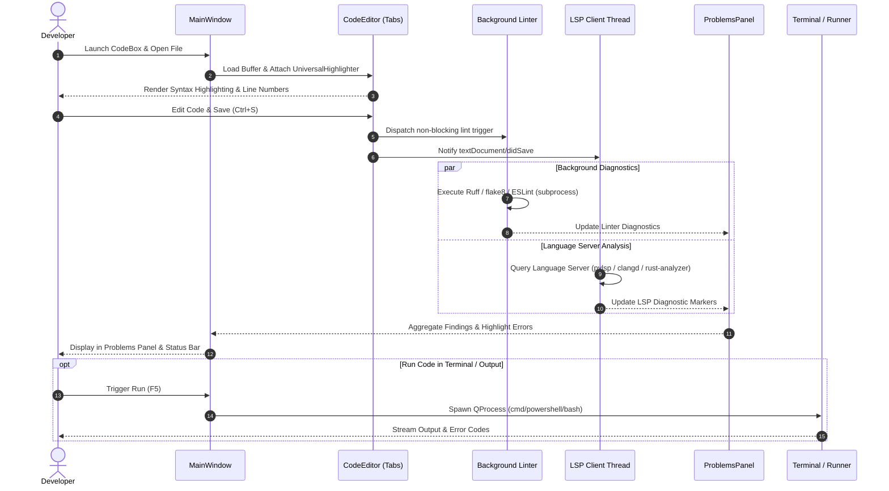

# CodeBox - Local PySide6 Desktop Code Editor

[](LICENSE)
[](NOTICE)
[](https://www.python.org/)
[]()
[](https://github.com/dev-bricks/CodeBox/actions/workflows/ci.yml)
[]()
[](SECURITY.md)
[](SECURITY.md)
[](https://github.com/dev-bricks)
[](https://github.com/open-bricks)
[]()
[](CHANGELOG.md)
[](THIRD_PARTY_LICENSES.md)
[](llms.txt)
[](llms.txt)

[Deutsch](README_de.md) | English

CodeBox is a local-first desktop IDE for Windows, Linux, and macOS developers who want a lightweight PySide6 code editor with multi-tab workspace, project tree, integrated terminal, Git status porcelain indicators, syntax highlighting, Language Server Protocol (LSP) diagnostics, and an extensible JSON/Python language plugin architecture.

> [!NOTE]
> For AI agents and automated discovery, see [llms.txt](llms.txt) for machine-readable context, architecture summaries, and navigation pointers.

---

## Quick Navigation

- [1. Start Here](#start-here)
- [2. System Architecture](#system-architecture)
- [3. End-to-End Workflow Lifecycle](#end-to-end-workflow-lifecycle)
- [4. Key Capabilities & Runtime Invariants](#key-capabilities--runtime-invariants)
- [5. Visual Showcase](#visual-showcase)
- [6. Target Personas & Use Cases](#target-personas--use-cases)
- [7. Comparative Matrix vs Alternatives](#comparative-matrix-vs-alternatives)
- [8. Features & Capabilities](#features)
- [9. Installation & Quickstart](#installation--quickstart)
- [10. Language Server Protocol (LSP) Setup](#language-server-protocol-lsp-setup)
- [11. Declarative Plugin System](#declarative-plugin-system)
- [12. Local Windows Build](#local-windows-build)
- [13. Project Structure](#project-structure)
- [14. Sibling Ecosystem](#sibling-ecosystem)
- [15. Search & Disambiguation](#search--disambiguation)
- [16. Third-Party Licenses & Level 1 SBOM](#third-party-licenses--level-1-sbom)
- [17. Security & Privacy](#security--privacy)
- [18. License & Liability](#license--liability)

---

<a id="start-here"></a><a id="schnellstart"></a>
## Start Here

| Need | Start with |
| --- | --- |
| Run the editor from source | `pip install -r requirements.txt` and `python main.py` |
| Open a specific file directly | `python main.py --open path/to/file.py` |
| Manage plugins & languages | `Ctrl+Shift+P` or menu *Edit -> Plugins & Languages...* |
| View keyboard shortcuts reference | `F1` or menu *Help -> Keyboard Shortcuts* |
| Build standalone Windows executable | `build_exe.bat` |
| Add diagnostics or completion | Install a local language server such as `python-lsp-server[all]` |
| Explore the development plan | [DEVELOPMENT_PLAN.md](DEVELOPMENT_PLAN.md) |
| Read security guidelines | [SECURITY.md](SECURITY.md) |

---

<a id="system-architecture"></a><a id="systemarchitektur"></a>
## System Architecture


```mermaid
flowchart TD
    subgraph UI ["Desktop UI Layer (PySide6)"]
        MW["MainWindow (ui/main_window.py)"]
        TB["ToolBar & Action Dispatcher"]
        ST["StatusBar & Position/Encoding/Language"]
        MW --> TB
        MW --> ST
    end

    subgraph Core ["Editor Core & Tab Management"]
        Tabs["TabWidget (core/tabs.py)"]
        Ed["CodeEditor & UniversalHighlighter (core/highlighter.py)"]
        MM["Minimap Widget (core/minimap.py)"]
        BM["BracketMatcher (core/bracket_matcher.py)"]
        Tabs --> Ed
        Ed --> MM
        Ed --> BM
    end

    subgraph Workspace ["Workspace & Project Tree"]
        PT["ProjectTree & FilterProxy (features/project_tree.py)"]
        Git["Git Porcelain Status Resolver (features/git_status.py)"]
        PT --> Git
    end

    subgraph Diagnostics ["Language Server & Diagnostics Engine"]
        LSPMgr["LSPManager & Client Thread (features/lsp_manager.py)"]
        Linter["Background Linter (Ruff/flake8/ESLint) (features/linter.py)"]
        Prob["ProblemsPanel (ui/problems_panel.py)"]
        LSPMgr --> Prob
        Linter --> Prob
    end

    subgraph Runtime ["Execution & Extensibility"]
        Term["Integrated Terminal QProcess (features/terminal.py)"]
        Out["OutputPanel Process Runner (core/output.py)"]
        PluginMgr["PluginManager (features/plugin_manager.py)"]
        Decl["Declarative Providers (languages/declarative.py)"]
        Theme["ThemeManager (features/theme_manager.py)"]
        PluginMgr --> Decl
    end

    MW --> Tabs
    MW --> PT
    MW --> Diagnostics
    MW --> Term
    MW --> Out
    MW --> PluginMgr
    MW --> Theme
```

---

<a id="end-to-end-workflow-lifecycle"></a><a id="end-to-end-workflow-lebenszyklus"></a>
## End-to-End Workflow Lifecycle


```mermaid
sequenceDiagram
    autonumber
    actor Dev as Developer
    participant UI as MainWindow
    participant Ed as CodeEditor (Tabs)
    participant Linter as Background Linter
    participant LSP as LSP Client Thread
    participant Prob as ProblemsPanel
    participant Term as Terminal / Runner

    Dev->>UI: Launch CodeBox & Open File
    UI->>Ed: Load Buffer & Attach UniversalHighlighter
    Ed-->>Dev: Render Syntax Highlighting & Line Numbers

    Dev->>Ed: Edit Code & Save (Ctrl+S)
    Ed->>Linter: Dispatch non-blocking lint trigger
    Ed->>LSP: Notify textDocument/didSave

    par Background Diagnostics
        Linter->>Linter: Execute Ruff / flake8 / ESLint (subprocess)
        Linter-->>Prob: Update Linter Diagnostics
    and Language Server Analysis
        LSP->>LSP: Query Language Server (pylsp / clangd / rust-analyzer)
        LSP-->>Prob: Update LSP Diagnostic Markers
    end

    Prob-->>UI: Aggregate Findings & Highlight Errors
    UI-->>Dev: Display in Problems Panel & Status Bar

    opt Run Code in Terminal / Output
        Dev->>UI: Trigger Run (F5)
        UI->>Term: Spawn QProcess (cmd/powershell/bash)
        Term-->>Dev: Stream Output & Error Codes
    end
```

---

<a id="key-capabilities--runtime-invariants"></a><a id="kernfaehigkeiten--laufzeitinvarianten"></a>
## Key Capabilities & Runtime Invariants

| Capability / Principle | Implementation Details | Guarantee / Invariant |
| --- | --- | --- |
| **Local-First & Zero-Egress** | Core editor, syntax highlighters, plugins, and terminal run 100% offline. | Zero telemetry, zero external network requests during standard editing. |
| **Non-Elevation (User Mode)** | Runs entirely in unprivileged user space. | No administrative or root privileges requested. |
| **Multi-Language Highlighting** | Universal regex engine (`UniversalHighlighter`) with boundary escaping. | Python, JavaScript, TypeScript, C++, Rust, Go, Java, and custom plugins. |
| **Extensible Plugin System** | Declarative JSON format (`plugins/*.json`) and dynamic Python classes. | Hot-reloading and auto-discovery without modifying core source files. |
| **LSP Diagnostics & Completion** | Thread-safe Qt client communicating with standard Language Servers over stdin/stdout. | Non-blocking UI; handles pylsp, typescript-language-server, rust-analyzer, clangd, gopls. |
| **Background Linting** | Asynchronous execution of local linters (Ruff, flake8, ESLint) on save. | Errors and warnings aggregated dynamically in unified Problems Panel. |
| **Save-Failure Resilience** | Guarded filesystem write operations with buffer preservation. | Tabs remain open and unsaved state is protected if filesystem write fails. |
| **Integrated Terminal** | Embedded `QProcess` terminal supporting `cmd`, `PowerShell`, and `bash`. | Dynamic encoding adaptation (cp1252 / utf-8) and working directory synchronisation. |
| **Multi-Root Workspaces** | Native `.codebox-workspace` format with portable relative paths. | Seamless project switching across multiple repository roots (`Ctrl+Shift+O`). |
| **Global Find in Files** | Multi-threaded background grep (`core/file_search.py`) with `Ctrl+Shift+F`. | Fast non-blocking search with Regex/Word/Case options and direct jump. |
| **Go to Definition & References** | LSP `textDocument/definition` & `references` (`F12`, `Shift+F12`) with AST/regex fallback. | Instant symbol navigation across open files and workspace projects. |
| **Tasks & TODO Sidebar** | Automatic background scan (`core/todo_scanner.py`) for TODO, FIXME, BUG, HACK (`Ctrl+Alt+T`). | Instant jump, grouping by file/tag, and real-time query filtering. |


---

<a id="visual-showcase"></a><a id="visuelle-demonstration"></a>
## Visual Showcase


*Figure 1: CodeBox desktop interface featuring the project navigation tree, multi-tab editor with syntax highlighting, integrated terminal, and diagnostics panel.*

---

<a id="target-personas--use-cases"></a><a id="zielgruppen--anwendungsfaelle"></a>
## Target Personas & Use Cases

CodeBox is architected for privacy-conscious developers, systems engineers, and specialized tooling builders requiring an air-gapped desktop IDE:

| Identifier | Target Persona | Core Need & Pain Point | How CodeBox Solves It | High-Intent Discovery Queries |
|---|---|---|---|---|
| **[PERSONA-01]** | **Local-First & Offline Developers** | Frustrated by forced cloud sign-ins, telemetry egress, and silent network activity in modern code editors. | 100% air-gapped zero-egress runtime (`INV-LOCAL-01`). No remote telemetry, no cloud dependencies, pure local execution. | `local-first code editor`, `zero-egress python IDE`, `offline code editor windows` |
| **[PERSONA-02]** | **Desktop & Systems Engineers** | Heavy Electron-based IDEs consuming gigabytes of RAM and taking 10+ seconds to launch on multi-project setups. | Native PySide6 / C++ Qt engine launching in <1 second with low base memory footprint and integrated multi-shell terminal (`INV-PERF-02`, `INV-TERM-06`). | `lightweight desktop IDE python`, `fast python code editor`, `pyside6 code editor` |
| **[PERSONA-03]** | **Security & Compliance Officers** | Requiring strict supply-chain transparency, unprivileged user mode, zero copyleft bleed, and defined vulnerability SLAs. | RunAsInvoker unprivileged execution (`INV-NOELEV-02`), Level 1 SBOM with dynamic LGPL-3.0 isolation (`INV-LGPL-03`), and 48-hour security response SLA (`INV-SLA-10`). | `secure offline editor SBOM`, `MIT code editor zero copyleft`, `enterprise compliant desktop IDE` |
| **[PERSONA-04]** | **DSL & Tooling Authors** | Complex extension models in legacy IDEs require compilation, packaging, and proprietary marketplace accounts. | Declarative JSON plugin system (`INV-PLUG-07`) allowing custom syntax highlighting, comment rules, and auto-pairing defined in simple JSON files with instant hot-reloading. | `declarative language editor plugin`, `custom dsl syntax highlighter`, `json language definition ide` |

---

<a id="comparative-matrix-vs-alternatives"></a><a id="vergleichsmatrix-gegenueber-alternativen"></a>
## Comparative Matrix vs Alternatives

The following matrix benchmarks CodeBox against 4 prevalent desktop development environments across 10 critical technical invariants:

| Technical Invariant | CodeBox (dev-bricks) | VS Code / VSCodium | Sublime Text | PyCharm Community | Lightweight CLI (Micro/Nano) |
|---|---|---|---|---|---|
| **INV-LOCAL-01: 100% Zero-Egress** | **Native Guarantee** (Zero telemetry, fully offline) | Partial / Requires manual telemetry opt-out | Native (Commercial closed-source) | Telemetry opt-out required | Native (Terminal only) |
| **INV-PERF-02: Cold-Start & Memory** | **<1.0s Cold-Start** (Native PySide6/Qt) | Heavy (Electron / Chromium RAM bloat) | Very Fast (Proprietary C++) | Slow (JVM memory footprint) | Instantaneous |
| **INV-LGPL-03: Zero-Copyleft Isolation** | **Pure Permissive / Dynamic LGPL** | Mixed MIT / Proprietary Marketplace | Proprietary License | Apache 2.0 | GPL-3.0 (Copyleft) |
| **INV-CRASH-04: Save-Failure Guard** | **Guarded Buffers** (State preserved on write error) | Yes | Yes | Yes | Vulnerable to terminal abort |
| **INV-LSP-05: Asynchronous LSP Engine** | **Thread-Safe Qt Client** (`pylsp`, `clangd`, etc.) | First-Class LSP Standard | Via LSP Plugin | Built-in proprietary indexing | None / External LSP wrapper |
| **INV-TERM-06: Embedded Multi-Shell** | **`QProcess` Terminal** (cmd/PowerShell/bash) | Integrated xterm.js | None (External terminal) | Integrated terminal | Native shell environment |
| **INV-PLUG-07: Declarative JSON Plugins** | **Instant JSON Schemas** (Zero compilation) | TypeScript Extension Bundle | Python scripts / Packages | Java / Kotlin plugins | Config file syntax rules |
| **INV-PORT-08: Multi-Root Workspaces** | **`.codebox-workspace`** (Relative portable paths) | `.code-workspace` | `.sublime-project` | `.idea` project directory | Directory arguments |
| **INV-GIT-09: Built-in Porcelain Git & Diff** | **Porcelain Status + Unified Diff** | Rich Git integration | Basic Git badges | Rich Git integration | CLI git commands |
| **INV-SLA-10: 48h Security SLA & § 521 BGB** | **Formal SLA + § 521 BGB Notice** | Community triage | Vendor support | JetBrains tracker | Best effort |

---

<a id="features"></a><a id="funktionsumfang"></a>
## Features & Capabilities

- **Quick-Open & Command Palette**: Instant file fuzzy matching (`Ctrl+P`) and interactive command palette (`Ctrl+Shift+P`) for keyboard-driven navigation.
- **Git Staging & Commit Dialog**: Built-in Git staging (`git add`, `git restore --staged`), discard changes, diff inspection, and commit dialog (`Ctrl+Alt+C`) directly from the project sidebar and view menu.
- **Integrated Git Diff-Viewer**: Side-by-side and unified diffs directly in the IDE (`Ctrl+Alt+D`).
- **Multi-Cursor & Column Selection**: Edit multiple document locations simultaneously, column selection (`Alt+Shift+Drag`), occurrence tagging (`Ctrl+Shift+L` / `Ctrl+Alt+L`), auto-pair wrapping, and atomic multi-cursor undo/redo.
- **Code Folding & Split Editor**: Interactive code folding with gutter indicators and side-by-side or stacked split panes with synchronized buffers.
- **Rich Syntax Highlighting**: Pre-configured highlighting for Python, JavaScript, TypeScript, C++, Rust, Go, and Java with punctuation-safe word boundary matching.
- **Declarative Plugin Architecture**: Create and extend language definitions in seconds using clean JSON schemas (`plugins/`, `~/.codebox/plugins/`).
- **Interactive Management Dialogs**: Full GUI dialogs for managing language plugins and reviewing keyboard shortcuts (`F1`).
- **Integrated Terminal**: Embedded native shell with command history, output streaming, and automatic directory synchronization.
- **Project File Tree**: Tree view with proxy search filtering, context actions, and Git porcelain status badges.
- **Multi-Tab Workspace**: Drag-and-drop tab reordering, save-failure protection, and absolute path tooltips.
- **Minimap Preview & Navigation**: Synchronized minimap overview, bracket auto-pairing, and go-to-line navigation (`Ctrl+G`).
- **Dual Theme System**: Seamless light/dark palette switching powered by `features/theme_manager.py`.
- **LSP Diagnostics & Completion**: Asynchronous background queries providing real-time diagnostics and code completions.
- **Automated Linters**: On-save Ruff, flake8, and ESLint integration piped directly to the unified Problems Panel.

---

<a id="installation--quickstart"></a><a id="installation--schnellstart"></a>
## Installation & Quickstart

```bash
# Clone the repository
git clone https://github.com/dev-bricks/CodeBox.git
cd CodeBox

# Install runtime dependencies
pip install -r requirements.txt

# Launch CodeBox
python main.py
```

On Windows, you can also launch CodeBox by double-clicking `start.bat`.

### System Requirements

- **Python**: 3.10, 3.11, 3.12, or 3.13
- **GUI Framework**: PySide6 >= 6.5.0
- **Operating Systems**: Windows 10/11, POSIX Linux (Ubuntu, Debian, Fedora), macOS

---

<a id="language-server-protocol-lsp-setup"></a><a id="lsp-einrichtung"></a>
## Language Server Protocol (LSP) Setup

CodeBox connects directly to standard Language Servers installed on your system:

| Language | Recommended Language Server | Installation Command |
| --- | --- | --- |
| **Python** | `python-lsp-server` (pylsp) | `pip install "python-lsp-server[all]"` |
| **TypeScript / JS** | `typescript-language-server` | `npm install -g typescript-language-server typescript` |
| **Rust** | `rust-analyzer` | `rustup component add rust-analyzer` |
| **Go** | `gopls` | `go install golang.org/x/tools/gopls@latest` |
| **C / C++** | `clangd` | Install LLVM / Clang package |

CodeBox prioritizes servers on your system `PATH` and automatically falls back to `python -m pylsp` when running in virtual environments.

---

<a id="declarative-plugin-system"></a><a id="deklaratives-plugin-system"></a>
## Declarative Plugin System

Define custom languages easily by placing a JSON file into `plugins/` or `~/.codebox/plugins/`:

```json
{
  "name": "CustomLang",
  "version": "1.0.0",
  "extensions": [".custom", ".cst"],
  "keywords": ["function", "end", "if", "then", "else", "return"],
  "comment_style": ["#"],
  "auto_close_pairs": {
    "(": ")",
    "[": "]",
    "{": "}"
  }
}
```

Reload plugins at runtime via the Plugin Manager (`Ctrl+Shift+P`).

---

<a id="local-windows-build"></a><a id="lokaler-windows-build"></a>
## Local Windows Build

Compile a standalone, zero-dependency Windows executable:

```bat
build_exe.bat
```

The build script uses PyInstaller with `CodeBox.spec` to bundle application icons, default themes, and declarative plugins into `dist\CodeBox.exe`.

---

<a id="project-structure"></a><a id="projektstruktur"></a>
## Project Structure

```text
CodeBox/
├── main.py                  # Application entry point & CLI parameter parser
├── version.py               # Central version constants & window title formatter
├── pyproject.toml           # PEP 621 packaging metadata & pytest configuration
├── requirements.txt         # Production runtime dependencies (PySide6)
├── core/                    # Core editor tabs, highlighter, minimap, output panel
├── features/                # Terminal, project tree, LSP manager, linter, themes, plugins
├── languages/               # Language definitions, providers, and declarative parser
├── ui/                      # MainWindow layout, settings, shortcuts, and plugin dialogs
├── plugins/                 # Bundled declarative language plugins (JSON)
├── themes/                  # QSS stylesheets (dark.qss, light.qss)
├── assets/                  # High-resolution vector banners and desktop icons
├── tests/                   # Comprehensive automated test suite (295+ tests)
└── README/screenshots/      # Visual showcase assets
```

---

<a id="sibling-ecosystem"></a><a id="geschwister-oekosystem"></a>
## Sibling Ecosystem

CodeBox integrates with the **dev-bricks** and **ellmos-ai** developer tooling ecosystem under the **open-bricks** umbrella:

| Repository | Focus Area | Ecosystem |
| --- | --- | --- |
| [dev-bricks/safe-start-for-codex](https://github.com/dev-bricks/safe-start-for-codex) | Startup gating utility for local Codex automations | `dev-bricks` |
| [dev-bricks/companion-for-agy](https://github.com/dev-bricks/companion-for-agy) | Node.js orchestration wrapper for Antigravity | `dev-bricks` |
| [dev-bricks/automation-master](https://github.com/dev-bricks/automation-master) | Task orchestration and automation supervisor | `dev-bricks` |
| [dev-bricks/automizer-for-claude-desktop](https://github.com/dev-bricks/automizer-for-claude-desktop) | Automation bridge for Claude Desktop | `dev-bricks` |
| [ellmos-ai/ellmos-codecommander-mcp](https://github.com/ellmos-ai/ellmos-codecommander-mcp) | AST analysis, refactoring, and code diagnosis MCP server | `ellmos-ai` |
| [ellmos-ai/ellmos-filecommander-mcp](https://github.com/ellmos-ai/ellmos-filecommander-mcp) | Safe filesystem manipulation and process supervisor MCP | `ellmos-ai` |
| [doc-bricks/CleanMarkdown](https://github.com/doc-bricks/CleanMarkdown) | Modern distraction-free Markdown desktop editor | `doc-bricks` |
| [file-bricks/ExplorerPro](https://github.com/file-bricks/ExplorerPro) | Multi-tab local desktop file manager | `file-bricks` |
| [open-bricks/.github](https://github.com/open-bricks/.github) | Umbrella open-source organization and standards | `open-bricks` |

---

<a id="search--disambiguation"></a><a id="suche--abgrenzung"></a>
## Search & Disambiguation

When searching for CodeBox, use precise keywords to differentiate from older unrelated repositories:

- `dev-bricks CodeBox`
- `CodeBox PySide6 desktop IDE`
- `local-first code editor Python Windows`
- `PySide6 code editor with LSP diagnostics`
- `lightweight offline code editor Python`
- `CodeBox declarative language plugin system`

---

<a id="third-party-licenses--level-1-sbom"></a><a id="drittanbieter-lizenzen--level-1-sbom"></a>
## Third-Party Licenses & Level 1 SBOM

CodeBox is distributed under the permissive MIT License. Full third-party dependencies, license texts, and compliance invariants are audited and documented:

- **Level 1 SBOM:** [`THIRD_PARTY_LICENSES.md`](THIRD_PARTY_LICENSES.md) (Audited 2026-09-23)
- **Component Text Inventory:** [`THIRD_PARTY_LICENSES.txt`](THIRD_PARTY_LICENSES.txt)
- **Legal Attribution & Copyright Notice:** [`NOTICE`](NOTICE)
- **Zero-Copyleft Guarantee:** PySide6 is dynamically linked via official PyPI wheels in full compliance with LGPL-3.0 Section 4. All bundled language plugins and core features are released under permissive terms.

---

<a id="security--privacy"></a><a id="sicherheit--datenschutz"></a>
## Security & Privacy

CodeBox adheres to strict security and privacy standards. Review [SECURITY.md](SECURITY.md) for full details:

- **100% Offline Runtime (`INV-LOCAL-01`)**: No tracking, telemetry, or unsolicited cloud communication.
- **Unprivileged Operation (`INV-NOELEV-02`)**: Runs strictly within standard user permissions (RunAsInvoker).
- **48-Hour Response SLA (`INV-SLA-10`)**: All vulnerability reports receive initial triage within 48 hours.
- **Confidential Reporting**: Vulnerabilities should be reported privately via [GitHub Security Advisories](https://github.com/dev-bricks/CodeBox/security/advisories/new) or by emailing `security@ellmos.ai` and `lukas@open-bricks.org`.

---

<a id="license--liability"></a><a id="lizenz--haftung"></a>
## License & Liability

This project is licensed under the [MIT License](LICENSE). Formal attribution is preserved in [`NOTICE`](NOTICE).

### Statutory Liability Limitation (§ 521 BGB)

This software is provided as an unpaid open-source contribution under Sections 516 et seq. of the German Civil Code (BGB). Pursuant to Section 521 BGB, liability is limited to intent and gross negligence. No warranty, availability guarantee, or fitness for any specific purpose is assumed.
