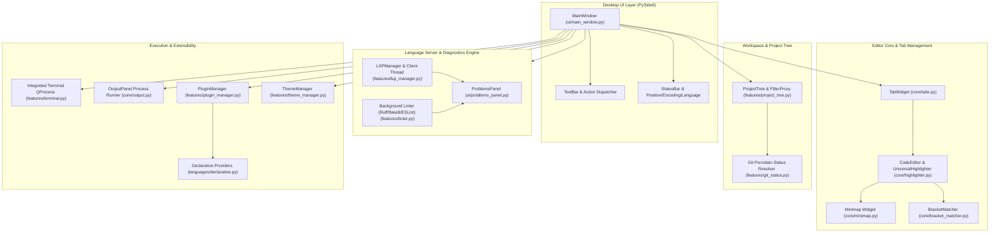
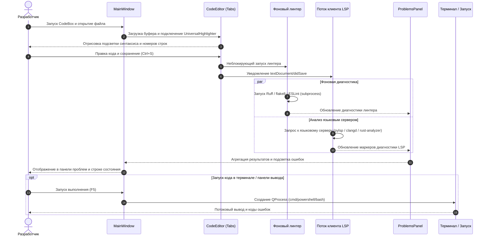

# CodeBox - локальный настольный редактор кода на PySide6

[](LICENSE)
[](NOTICE)
[](https://www.python.org/)
[]()
[](https://github.com/dev-bricks/CodeBox/actions/workflows/ci.yml)
[]()
[](SECURITY.md)
[](SECURITY.md)
[](https://github.com/dev-bricks)
[](https://github.com/open-bricks)
[]()
[](CHANGELOG.md)
[](THIRD_PARTY_LICENSES.md)
[](llms.txt)
[](llms.txt)

[English](README.md) | [Deutsch](README_de.md) | [Español](README.es.md) | [简体中文](README.zh.md) | [日本語](README.ja.md) | Русский

> Этот перевод выполнен с помощью машинного перевода; приоритет имеет английский README.md.

CodeBox - это локальная (local-first) настольная IDE для разработчиков под Windows, Linux и macOS, которым нужен лёгкий редактор кода на PySide6 с многовкладочным рабочим пространством, деревом проекта, встроенным терминалом, индикаторами статуса Git (porcelain), подсветкой синтаксиса, диагностикой Language Server Protocol (LSP) и расширяемой архитектурой языковых плагинов на JSON/Python.

> [!NOTE]
> Для ИИ-агентов и автоматизированного обнаружения см. [llms.txt](llms.txt): там содержатся машиночитаемый контекст, краткие описания архитектуры и навигационные указатели.

---

## Быстрая навигация

- [1. С чего начать](#start-here)
- [2. Архитектура системы](#system-architecture)
- [3. Полный жизненный цикл рабочего процесса](#end-to-end-workflow-lifecycle)
- [4. Ключевые возможности и инварианты времени выполнения](#key-capabilities--runtime-invariants)
- [5. Визуальная демонстрация](#visual-showcase)
- [6. Целевые персоны и сценарии использования](#target-personas--use-cases)
- [7. Сравнительная матрица с альтернативами](#comparative-matrix-vs-alternatives)
- [8. Функции и возможности](#features)
- [9. Установка и быстрый старт](#installation--quickstart)
- [10. Настройка Language Server Protocol (LSP)](#language-server-protocol-lsp-setup)
- [11. Декларативная система плагинов](#declarative-plugin-system)
- [12. Локальная сборка для Windows](#local-windows-build)
- [13. Структура проекта](#project-structure)
- [14. Родственная экосистема](#sibling-ecosystem)
- [15. Поиск и разграничение](#search--disambiguation)
- [16. Сторонние лицензии и SBOM уровня 1](#third-party-licenses--level-1-sbom)
- [17. Безопасность и конфиденциальность](#security--privacy)
- [18. Лицензия и ответственность](#license--liability)

---

<a id="start-here"></a><a id="schnellstart"></a>
## С чего начать

| Задача | С чего начать |
| --- | --- |
| Запустить редактор из исходного кода | `pip install -r requirements.txt` и `python main.py` |
| Сразу открыть конкретный файл | `python main.py --open path/to/file.py` |
| Управлять плагинами и языками | `Ctrl+Shift+P` или меню *Edit -> Plugins & Languages...* |
| Посмотреть справку по сочетаниям клавиш | `F1` или меню *Help -> Keyboard Shortcuts* |
| Собрать автономный исполняемый файл для Windows | `build_exe.bat` |
| Добавить диагностику или автодополнение | Установите локальный языковой сервер, например `python-lsp-server[all]` |
| Ознакомиться с планом разработки | [DEVELOPMENT_PLAN.md](DEVELOPMENT_PLAN.md) |
| Прочитать руководство по безопасности | [SECURITY.md](SECURITY.md) |

---

<a id="system-architecture"></a><a id="systemarchitektur"></a>
## Архитектура системы



---

<a id="end-to-end-workflow-lifecycle"></a><a id="end-to-end-workflow-lebenszyklus"></a>
## Полный жизненный цикл рабочего процесса



---

<a id="key-capabilities--runtime-invariants"></a><a id="kernfaehigkeiten--laufzeitinvarianten"></a>
## Ключевые возможности и инварианты времени выполнения

| Возможность / принцип | Детали реализации | Гарантия / инвариант |
| --- | --- | --- |
| **Local-First и Zero-Egress** | Ядро редактора, подсветка синтаксиса, плагины и терминал работают на 100% офлайн. | Ноль телеметрии, ноль внешних сетевых запросов при обычном редактировании. |
| **Без повышения привилегий (пользовательский режим)** | Работает целиком в непривилегированном пользовательском пространстве. | Права администратора или root не запрашиваются. |
| **Подсветка для нескольких языков** | Универсальный regex-движок (`UniversalHighlighter`) с экранированием границ. | Python, JavaScript, TypeScript, C++, Rust, Go, Java и пользовательские плагины. |
| **Расширяемая система плагинов** | Декларативный формат JSON (`plugins/*.json`) и динамические классы Python. | Горячая перезагрузка и автообнаружение без изменения исходного кода ядра. |
| **Диагностика и автодополнение LSP** | Потокобезопасный клиент Qt, взаимодействующий со стандартными языковыми серверами через stdin/stdout. | Неблокирующий интерфейс; поддержка pylsp, typescript-language-server, rust-analyzer, clangd, gopls. |
| **Фоновый линтинг** | Асинхронный запуск локальных линтеров (Ruff, flake8, ESLint) при сохранении. | Ошибки и предупреждения динамически собираются в единой панели проблем. |
| **Устойчивость к сбоям сохранения** | Защищённые операции записи в файловую систему с сохранением буфера. | Вкладки остаются открытыми, а несохранённое состояние защищено при сбое записи в файловую систему. |
| **Встроенный терминал** | Встроенный терминал на `QProcess` с поддержкой `cmd`, `PowerShell` и `bash`. | Динамическая адаптация кодировки (cp1252 / utf-8) и синхронизация рабочего каталога. |
| **Многокорневые рабочие пространства** | Собственный формат `.codebox-workspace` с переносимыми относительными путями. | Бесшовное переключение между проектами с несколькими корнями репозиториев (`Ctrl+Shift+O`). |
| **Глобальный поиск по файлам** | Многопоточный фоновый grep (`core/file_search.py`) по `Ctrl+Shift+F`. | Быстрый неблокирующий поиск с опциями Regex/слово/регистр и прямым переходом к результату. |
| **Переход к определению и ссылкам** | LSP `textDocument/definition` и `references` (`F12`, `Shift+F12`) с запасным вариантом на AST/regex. | Мгновенная навигация по символам между открытыми файлами и проектами рабочего пространства. |
| **Боковая панель задач и TODO** | Автоматическое фоновое сканирование (`core/todo_scanner.py`) на TODO, FIXME, BUG, HACK (`Ctrl+Alt+T`). | Мгновенный переход, группировка по файлам/тегам и фильтрация запроса в реальном времени. |


---

<a id="visual-showcase"></a><a id="visuelle-demonstration"></a>
## Визуальная демонстрация


*Рисунок 1: Настольный интерфейс CodeBox: дерево навигации по проекту, многовкладочный редактор с подсветкой синтаксиса, встроенный терминал и панель диагностики.*

---

<a id="target-personas--use-cases"></a><a id="zielgruppen--anwendungsfaelle"></a>
## Целевые персоны и сценарии использования

CodeBox спроектирован для разработчиков, ценящих конфиденциальность, системных инженеров и авторов специализированных инструментов, которым нужна настольная IDE, работающая в изолированном (air-gapped) режиме:

| Идентификатор | Целевая персона | Основная потребность и проблема | Как CodeBox это решает | Типичные поисковые запросы |
|---|---|---|---|---|
| **[PERSONA-01]** | **Разработчики local-first и офлайн** | Раздражает принудительный вход в облако, отправка телеметрии и скрытая сетевая активность в современных редакторах кода. | 100% изолированная среда выполнения без исходящего трафика (`INV-LOCAL-01`). Никакой удалённой телеметрии, никаких облачных зависимостей, только локальное выполнение. | `local-first code editor`, `zero-egress python IDE`, `offline code editor windows` |
| **[PERSONA-02]** | **Инженеры настольных и системных приложений** | Тяжёлые IDE на Electron потребляют гигабайты ОЗУ и запускаются более 10 секунд в многопроектных конфигурациях. | Нативный движок PySide6 / C++ Qt запускается менее чем за 1 секунду при небольшом базовом потреблении памяти и со встроенным терминалом для нескольких оболочек (`INV-PERF-02`, `INV-TERM-06`). | `lightweight desktop IDE python`, `fast python code editor`, `pyside6 code editor` |
| **[PERSONA-03]** | **Специалисты по безопасности и комплаенсу** | Требуются строгая прозрачность цепочки поставок, непривилегированный пользовательский режим, отсутствие «просачивания» копилефта и определённые SLA по уязвимостям. | Непривилегированное выполнение RunAsInvoker (`INV-NOELEV-02`), SBOM уровня 1 с динамической изоляцией LGPL-3.0 (`INV-LGPL-03`) и SLA реагирования на проблемы безопасности в 48 часов (`INV-SLA-10`). | `secure offline editor SBOM`, `MIT code editor zero copyleft`, `enterprise compliant desktop IDE` |
| **[PERSONA-04]** | **Авторы DSL и инструментов** | Сложные модели расширений в устаревших IDE требуют компиляции, упаковки и учётных записей в проприетарных маркетплейсах. | Декларативная система плагинов на JSON (`INV-PLUG-07`) позволяет задавать собственную подсветку синтаксиса, правила комментариев и автозакрытие пар в простых JSON-файлах с мгновенной горячей перезагрузкой. | `declarative language editor plugin`, `custom dsl syntax highlighter`, `json language definition ide` |

---

<a id="comparative-matrix-vs-alternatives"></a><a id="vergleichsmatrix-gegenueber-alternativen"></a>
## Сравнительная матрица с альтернативами

Следующая матрица сопоставляет CodeBox с 4 распространёнными настольными средами разработки по 10 критически важным техническим инвариантам:

| Технический инвариант | CodeBox (dev-bricks) | VS Code / VSCodium | Sublime Text | PyCharm Community | Лёгкие CLI-редакторы (Micro/Nano) |
|---|---|---|---|---|---|
| **INV-LOCAL-01: 100% Zero-Egress** | **Встроенная гарантия** (ноль телеметрии, полностью офлайн) | Частично / требуется ручное отключение телеметрии | Встроенная (коммерческий закрытый код) | Требуется отключение телеметрии | Встроенная (только терминал) |
| **INV-PERF-02: Холодный старт и память** | **Холодный старт <1,0 с** (нативный PySide6/Qt) | Тяжёлый (раздутое потребление ОЗУ из-за Electron / Chromium) | Очень быстрый (проприетарный C++) | Медленный (нагрузка на память от JVM) | Мгновенный |
| **INV-LGPL-03: Изоляция от копилефта** | **Чисто разрешающая лицензия / динамическая LGPL** | Смешанная MIT / проприетарный маркетплейс | Проприетарная лицензия | Apache 2.0 | GPL-3.0 (копилефт) |
| **INV-CRASH-04: Защита от сбоя сохранения** | **Защищённые буферы** (состояние сохраняется при ошибке записи) | Да | Да | Да | Уязвим к аварийному завершению терминала |
| **INV-LSP-05: Асинхронный движок LSP** | **Потокобезопасный клиент Qt** (`pylsp`, `clangd` и др.) | Стандарт LSP первого класса | Через плагин LSP | Встроенное проприетарное индексирование | Нет / внешняя обёртка LSP |
| **INV-TERM-06: Встроенный терминал для нескольких оболочек** | **Терминал на `QProcess`** (cmd/PowerShell/bash) | Встроенный xterm.js | Нет (внешний терминал) | Встроенный терминал | Нативная среда оболочки |
| **INV-PLUG-07: Декларативные плагины JSON** | **Мгновенные схемы JSON** (без компиляции) | Пакет расширения на TypeScript | Скрипты Python / пакеты | Плагины на Java / Kotlin | Правила синтаксиса в файле конфигурации |
| **INV-PORT-08: Многокорневые рабочие пространства** | **`.codebox-workspace`** (относительные переносимые пути) | `.code-workspace` | `.sublime-project` | Каталог проекта `.idea` | Аргументы-каталоги |
| **INV-GIT-09: Встроенный Git porcelain и Diff** | **Статус Porcelain + унифицированный Diff** | Богатая интеграция с Git | Базовые индикаторы Git | Богатая интеграция с Git | Команды git в CLI |
| **INV-SLA-10: SLA безопасности 48 ч и § 521 BGB** | **Формальный SLA + уведомление по § 521 BGB** | Сортировка силами сообщества | Поддержка вендора | Трекер JetBrains | По мере возможности |

---

<a id="features"></a><a id="funktionsumfang"></a>
## Функции и возможности

- **Выражения наблюдения отладчика и панель стека вызовов**: интерактивный мониторинг переменных и выражений (`Ctrl+Shift+W`), просмотр кадров стека вызовов с прямым переходом к строке исходного кода, строка мгновенного вычисления выражений и синхронизация с живой сессией PDB (`Ctrl+Shift+D`).
- **Менеджер сниппетов и раскрытие по Tab**: встроенная навигация по точкам табуляции (`$1`, `${1:default}`, `$0`) клавишами `Tab` / `Shift+Tab`, встроенные каталоги сниппетов для 10 языков программирования и разметки, постоянное хранение пользовательских сниппетов в JSON и интерактивный `SnippetsDialog` (`Ctrl+Shift+J`).
- **Быстрое открытие и палитра команд**: мгновенный нечёткий поиск файлов (`Ctrl+P`) и интерактивная палитра команд (`Ctrl+Shift+P`) для навигации с клавиатуры.
- **Индексация Git и диалог коммита**: встроенная индексация Git (`git add`, `git restore --staged`), отмена изменений, просмотр diff и диалог коммита (`Ctrl+Alt+C`) прямо из боковой панели проекта и меню «Вид».
- **Встроенный просмотрщик Git Diff**: параллельный и унифицированный diff прямо в IDE (`Ctrl+Alt+D`).
- **Несколько курсоров и выделение столбцом**: одновременное редактирование нескольких мест документа, выделение столбцом (`Alt+Shift+Drag`), пометка вхождений (`Ctrl+Shift+L` / `Ctrl+Alt+L`), обрамление парными символами и атомарные отмена/повтор для нескольких курсоров.
- **Сворачивание кода и разделённый редактор**: интерактивное сворачивание кода с индикаторами в поле и параллельные либо вертикально расположенные разделённые панели с синхронизированными буферами.
- **Богатая подсветка синтаксиса**: предварительно настроенная подсветка для Python, JavaScript, TypeScript, C++, Rust, Go и Java с учётом границ слов и знаков препинания.
- **Декларативная архитектура плагинов**: создавайте и расширяйте определения языков за секунды с помощью простых схем JSON (`plugins/`, `~/.codebox/plugins/`).
- **Интерактивные диалоги управления**: полноценные графические диалоги для управления языковыми плагинами и просмотра сочетаний клавиш (`F1`).
- **Встроенный терминал**: встроенная нативная оболочка с историей команд, потоковым выводом и автоматической синхронизацией каталога.
- **Дерево файлов проекта**: древовидное представление с фильтрацией через прокси-поиск, контекстными действиями и индикаторами статуса Git porcelain.
- **Многовкладочное рабочее пространство**: изменение порядка вкладок перетаскиванием, защита от сбоя сохранения и всплывающие подсказки с абсолютным путём.
- **Предпросмотр миникарты и навигация**: синхронизированная миникарта, автозакрытие скобок и переход к строке (`Ctrl+G`).
- **Многоязычный интерфейс (6 языков)**: немецкий, английский, испанский, китайский, японский и русский; переключается во время работы через *View -> Language* или диалог настроек, с четырёхступенчатой цепочкой резервных вариантов (`target -> en -> de -> key`).
- **Двойная система тем**: плавное переключение светлой/тёмной палитры на основе `features/theme_manager.py`.
- **Диагностика и автодополнение LSP**: асинхронные фоновые запросы, обеспечивающие диагностику и автодополнение кода в реальном времени.
- **Автоматические линтеры**: интеграция Ruff, flake8 и ESLint при сохранении с выводом прямо в единую панель проблем.

---

<a id="installation--quickstart"></a><a id="installation--schnellstart"></a>
## Установка и быстрый старт

```bash
# Clone the repository
git clone https://github.com/dev-bricks/CodeBox.git
cd CodeBox

# Install runtime dependencies
pip install -r requirements.txt

# Launch CodeBox
python main.py
```

В Windows CodeBox можно также запустить двойным щелчком по `start.bat`.

### Системные требования

- **Python**: 3.10, 3.11, 3.12 или 3.13
- **GUI-фреймворк**: PySide6 >= 6.5.0
- **Операционные системы**: Windows 10/11, POSIX Linux (Ubuntu, Debian, Fedora), macOS

---

<a id="language-server-protocol-lsp-setup"></a><a id="lsp-einrichtung"></a>
## Настройка Language Server Protocol (LSP)

CodeBox напрямую подключается к стандартным языковым серверам, установленным в вашей системе:

| Язык | Рекомендуемый языковой сервер | Команда установки |
| --- | --- | --- |
| **Python** | `python-lsp-server` (pylsp) | `pip install "python-lsp-server[all]"` |
| **TypeScript / JS** | `typescript-language-server` | `npm install -g typescript-language-server typescript` |
| **Rust** | `rust-analyzer` | `rustup component add rust-analyzer` |
| **Go** | `gopls` | `go install golang.org/x/tools/gopls@latest` |
| **C / C++** | `clangd` | Установите пакет LLVM / Clang |

CodeBox отдаёт приоритет серверам из системного `PATH` и автоматически переключается на `python -m pylsp` при работе в виртуальных окружениях.

---

<a id="declarative-plugin-system"></a><a id="deklaratives-plugin-system"></a>
## Декларативная система плагинов

Определяйте собственные языки просто: поместите JSON-файл в `plugins/` или `~/.codebox/plugins/`:

```json
{
  "name": "CustomLang",
  "version": "1.0.0",
  "extensions": [".custom", ".cst"],
  "keywords": ["function", "end", "if", "then", "else", "return"],
  "comment_style": ["#"],
  "auto_close_pairs": {
    "(": ")",
    "[": "]",
    "{": "}"
  }
}
```

Перезагружайте плагины во время работы через менеджер плагинов (`Ctrl+Shift+P`).

---

<a id="local-windows-build"></a><a id="lokaler-windows-build"></a>
## Локальная сборка для Windows

Соберите автономный исполняемый файл для Windows без внешних зависимостей:

```bat
build_exe.bat
```

Скрипт сборки использует PyInstaller с `CodeBox.spec` и упаковывает значки приложения, темы по умолчанию и декларативные плагины в `%LOCALAPPDATA%\CodeBox\build\dist\CodeBox.exe` (расположение можно переопределить переменной окружения `CODEBOX_BUILD_ROOT`).

---

<a id="project-structure"></a><a id="projektstruktur"></a>
## Структура проекта

```text
CodeBox/
├── main.py                  # Application entry point & CLI parameter parser
├── version.py               # Central version constants & window title formatter
├── translator.py            # TranslationSystem v2.0 with 4-stage fallback chain (P-006)
├── manage_translations.py   # Translation parity validator CLI (--check) for CI/CD
├── pyproject.toml           # PEP 621 packaging metadata & pytest configuration
├── requirements.txt         # Production runtime dependencies (PySide6)
├── locales/                 # Localization catalogs (translations.json, 6 languages)
├── core/                    # Core editor tabs, highlighter, minimap, output panel
├── features/                # Terminal, project tree, LSP manager, linter, themes, plugins
├── languages/               # Language definitions, providers, and declarative parser
├── ui/                      # MainWindow layout, settings, shortcuts, and plugin dialogs
├── plugins/                 # Bundled declarative language plugins (JSON)
├── themes/                  # QSS stylesheets (dark.qss, light.qss)
├── assets/                  # High-resolution vector banners and desktop icons
├── tests/                   # Comprehensive automated test suite (360 tests)
└── README/screenshots/      # Visual showcase assets
```

---

<a id="sibling-ecosystem"></a><a id="geschwister-oekosystem"></a>
## Родственная экосистема

CodeBox интегрируется с экосистемой инструментов разработчика **dev-bricks** и **ellmos-ai** под эгидой **open-bricks**:

| Репозиторий | Область применения | Экосистема |
| --- | --- | --- |
| [dev-bricks/safe-start-for-codex](https://github.com/dev-bricks/safe-start-for-codex) | Утилита контроля запуска для локальных автоматизаций Codex | `dev-bricks` |
| [dev-bricks/companion-for-agy](https://github.com/dev-bricks/companion-for-agy) | Обёртка для оркестрации Antigravity на Node.js | `dev-bricks` |
| automation-master (не публичный) | Оркестрация задач и супервизор автоматизации | `dev-bricks` |
| [dev-bricks/automizer-for-claude-desktop](https://github.com/dev-bricks/automizer-for-claude-desktop) | Мост автоматизации для Claude Desktop | `dev-bricks` |
| [ellmos-ai/ellmos-codecommander-mcp](https://github.com/ellmos-ai/ellmos-codecommander-mcp) | MCP-сервер для AST-анализа, рефакторинга и диагностики кода | `ellmos-ai` |
| [ellmos-ai/ellmos-filecommander-mcp](https://github.com/ellmos-ai/ellmos-filecommander-mcp) | MCP для безопасной работы с файловой системой и супервизор процессов | `ellmos-ai` |
| [doc-bricks/CleanMarkdown](https://github.com/doc-bricks/CleanMarkdown) | Современный настольный редактор Markdown без отвлекающих элементов | `doc-bricks` |
| [file-bricks/ExplorerPro](https://github.com/file-bricks/ExplorerPro) | Многовкладочный локальный настольный файловый менеджер | `file-bricks` |
| [open-bricks/.github](https://github.com/open-bricks/.github) | Объединяющая организация с открытым исходным кодом и стандарты | `open-bricks` |

---

<a id="search--disambiguation"></a><a id="suche--abgrenzung"></a>
## Поиск и разграничение

При поиске CodeBox используйте точные ключевые слова, чтобы отличать его от старых несвязанных репозиториев:

- `dev-bricks CodeBox`
- `CodeBox PySide6 desktop IDE`
- `local-first code editor Python Windows`
- `PySide6 code editor with LSP diagnostics`
- `lightweight offline code editor Python`
- `CodeBox declarative language plugin system`

---

<a id="third-party-licenses--level-1-sbom"></a><a id="drittanbieter-lizenzen--level-1-sbom"></a>
## Сторонние лицензии и SBOM уровня 1

CodeBox распространяется под разрешающей лицензией MIT. Полный перечень сторонних зависимостей, тексты лицензий и инварианты соответствия проверены и задокументированы:

- **SBOM уровня 1:** [`THIRD_PARTY_LICENSES.md`](THIRD_PARTY_LICENSES.md) (аудит от 2026-09-23)
- **Текстовый перечень компонентов:** [`THIRD_PARTY_LICENSES.txt`](THIRD_PARTY_LICENSES.txt)
- **Юридическая атрибуция и уведомление об авторских правах:** [`NOTICE`](NOTICE)
- **Гарантия отсутствия копилефта:** PySide6 подключается динамически через официальные wheel-пакеты PyPI в полном соответствии с разделом 4 LGPL-3.0. Все включённые языковые плагины и основные функции распространяются на разрешающих условиях.

---

<a id="security--privacy"></a><a id="sicherheit--datenschutz"></a>
## Безопасность и конфиденциальность

CodeBox придерживается строгих стандартов безопасности и конфиденциальности. Подробности см. в [SECURITY.md](SECURITY.md):

- **100% офлайн-среда выполнения (`INV-LOCAL-01`)**: никакого отслеживания, телеметрии или несанкционированного обмена данными с облаком.
- **Работа без повышения привилегий (`INV-NOELEV-02`)**: строго в рамках стандартных прав пользователя (RunAsInvoker).
- **SLA реагирования в 48 часов (`INV-SLA-10`)**: по всем сообщениям об уязвимостях первичная сортировка проводится в течение 48 часов.
- **Конфиденциальное сообщение об уязвимостях**: о них следует сообщать приватно через [GitHub Security Advisories](https://github.com/dev-bricks/CodeBox/security/advisories/new) или по электронной почте `security@ellmos.ai` и `lukas@open-bricks.org`.

---

<a id="license--liability"></a><a id="lizenz--haftung"></a>
## Лицензия и ответственность

Этот проект распространяется по [лицензии MIT](LICENSE). Формальная атрибуция сохранена в файле [`NOTICE`](NOTICE).

### Законодательное ограничение ответственности (§ 521 BGB)

Это программное обеспечение предоставляется как безвозмездный вклад в открытый исходный код в соответствии с § 516 и последующими Гражданского кодекса Германии (BGB). В соответствии с § 521 BGB ответственность ограничена умыслом и грубой неосторожностью. Никакие гарантии, гарантии доступности или пригодности для какой-либо конкретной цели не предоставляются.
