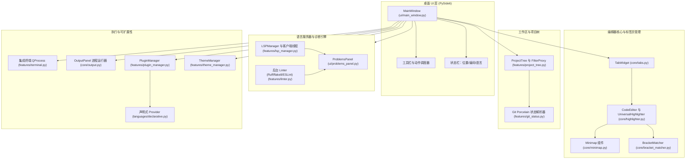
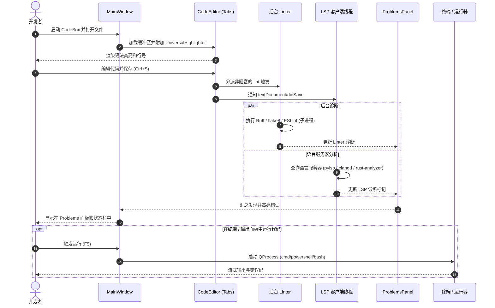

# CodeBox - 本地 PySide6 桌面代码编辑器

[](LICENSE)
[](NOTICE)
[](https://www.python.org/)
[]()
[](https://github.com/dev-bricks/CodeBox/actions/workflows/ci.yml)
[]()
[](SECURITY.md)
[](SECURITY.md)
[](https://github.com/dev-bricks)
[](https://github.com/open-bricks)
[]()
[](CHANGELOG.md)
[](THIRD_PARTY_LICENSES.md)
[](llms.txt)
[](llms.txt)

[English](README.md) | [Deutsch](README_de.md) | [Español](README.es.md) | 简体中文 | [日本語](README.ja.md) | [Русский](README.ru.md)

> 本文为机器辅助翻译；以英文 README.md 为准。

CodeBox 是一款本地优先（local-first）的桌面 IDE，面向 Windows、Linux 和 macOS 开发者，适合需要轻量级 PySide6 代码编辑器的用户：支持多标签页工作区、项目树、集成终端、Git porcelain 状态指示、语法高亮、Language Server Protocol（LSP）诊断，以及可扩展的 JSON/Python 语言插件架构。

> [!NOTE]
> 面向 AI 代理和自动化发现：请参阅 [llms.txt](llms.txt)，获取机器可读的上下文、架构摘要和导航指引。

---

## 快速导航

- [1. 从这里开始](#start-here)
- [2. 系统架构](#system-architecture)
- [3. 端到端工作流生命周期](#end-to-end-workflow-lifecycle)
- [4. 核心能力与运行时不变量](#key-capabilities--runtime-invariants)
- [5. 视觉展示](#visual-showcase)
- [6. 目标用户画像与使用场景](#target-personas--use-cases)
- [7. 与其他方案的对比矩阵](#comparative-matrix-vs-alternatives)
- [8. 功能与能力](#features)
- [9. 安装与快速入门](#installation--quickstart)
- [10. Language Server Protocol（LSP）配置](#language-server-protocol-lsp-setup)
- [11. 声明式插件系统](#declarative-plugin-system)
- [12. 本地 Windows 构建](#local-windows-build)
- [13. 项目结构](#project-structure)
- [14. 兄弟生态系统](#sibling-ecosystem)
- [15. 搜索与消歧](#search--disambiguation)
- [16. 第三方许可证与 Level 1 SBOM](#third-party-licenses--level-1-sbom)
- [17. 安全与隐私](#security--privacy)
- [18. 许可证与责任](#license--liability)

---

<a id="start-here"></a><a id="schnellstart"></a>
## 1. 从这里开始

| 需求 | 起点 |
| --- | --- |
| 从源码运行编辑器 | `pip install -r requirements.txt` 和 `python main.py` |
| 直接打开指定文件 | `python main.py --open path/to/file.py` |
| 管理插件与语言 | `Ctrl+Shift+P` 或菜单 *Edit -> Plugins & Languages...* |
| 查看键盘快捷键参考 | `F1` 或菜单 *Help -> Keyboard Shortcuts* |
| 构建独立的 Windows 可执行文件 | `build_exe.bat` |
| 添加诊断或代码补全 | 安装本地语言服务器，例如 `python-lsp-server[all]` |
| 了解开发计划 | [DEVELOPMENT_PLAN.md](DEVELOPMENT_PLAN.md) |
| 阅读安全指南 | [SECURITY.md](SECURITY.md) |

---

<a id="system-architecture"></a><a id="systemarchitektur"></a>
## 2. 系统架构



---

<a id="end-to-end-workflow-lifecycle"></a><a id="end-to-end-workflow-lebenszyklus"></a>
## 3. 端到端工作流生命周期



---

<a id="key-capabilities--runtime-invariants"></a><a id="kernfaehigkeiten--laufzeitinvarianten"></a>
## 4. 核心能力与运行时不变量

| 能力 / 原则 | 实现细节 | 保证 / 不变量 |
| --- | --- | --- |
| **本地优先与零外发（Zero-Egress）** | 核心编辑器、语法高亮器、插件和终端 100% 离线运行。 | 标准编辑期间零遥测、零外部网络请求。 |
| **无需提权（用户模式）** | 完全在无特权的用户空间中运行。 | 不请求管理员或 root 权限。 |
| **多语言高亮** | 带边界转义的通用正则引擎（`UniversalHighlighter`）。 | Python、JavaScript、TypeScript、C++、Rust、Go、Java 以及自定义插件。 |
| **可扩展插件系统** | 声明式 JSON 格式（`plugins/*.json`）和动态 Python 类。 | 热重载与自动发现，无需修改核心源文件。 |
| **LSP 诊断与补全** | 线程安全的 Qt 客户端，通过 stdin/stdout 与标准语言服务器通信。 | UI 不阻塞；支持 pylsp、typescript-language-server、rust-analyzer、clangd、gopls。 |
| **后台 Lint** | 保存时异步执行本地 Linter（Ruff、flake8、ESLint）。 | 错误和警告动态汇总到统一的 Problems 面板。 |
| **保存失败韧性** | 带缓冲区保护的受保护文件系统写入操作。 | 文件系统写入失败时，标签页保持打开，未保存状态受到保护。 |
| **集成终端** | 内嵌 `QProcess` 终端，支持 `cmd`、`PowerShell` 和 `bash`。 | 动态编码适配（cp1252 / utf-8）和工作目录同步。 |
| **多根工作区** | 原生 `.codebox-workspace` 格式，使用可移植的相对路径。 | 在多个仓库根目录之间无缝切换项目（`Ctrl+Shift+O`）。 |
| **全局文件内查找** | 多线程后台 grep（`core/file_search.py`），快捷键 `Ctrl+Shift+F`。 | 快速、非阻塞的搜索，支持正则/整词/大小写选项并可直接跳转。 |
| **转到定义与引用** | LSP `textDocument/definition` 和 `references`（`F12`、`Shift+F12`），带 AST/正则回退。 | 在已打开文件和工作区项目之间即时导航符号。 |
| **任务与 TODO 侧边栏** | 自动后台扫描（`core/todo_scanner.py`）TODO、FIXME、BUG、HACK（`Ctrl+Alt+T`）。 | 即时跳转、按文件/标签分组以及实时查询过滤。 |


---

<a id="visual-showcase"></a><a id="visuelle-demonstration"></a>
## 5. 视觉展示


*图 1：CodeBox 桌面界面，包含项目导航树、带语法高亮的多标签页编辑器、集成终端和诊断面板。*

---

<a id="target-personas--use-cases"></a><a id="zielgruppen--anwendungsfaelle"></a>
## 6. 目标用户画像与使用场景

CodeBox 面向注重隐私的开发者、系统工程师以及需要物理隔离（air-gapped）桌面 IDE 的专用工具构建者：

| 标识 | 目标用户画像 | 核心需求与痛点 | CodeBox 如何解决 | 高意图发现查询 |
|---|---|---|---|---|
| **[PERSONA-01]** | **本地优先与离线开发者** | 对现代代码编辑器中强制云端登录、遥测外发和静默网络活动感到不满。 | 100% 物理隔离的零外发运行时（`INV-LOCAL-01`）。无远程遥测、无云依赖，纯本地执行。 | `local-first code editor`, `zero-egress python IDE`, `offline code editor windows` |
| **[PERSONA-02]** | **桌面与系统工程师** | 基于 Electron 的重型 IDE 占用数 GB 内存，在多项目环境下启动需 10 秒以上。 | 原生 PySide6 / C++ Qt 引擎，启动时间小于 1 秒，基础内存占用低，并集成多 shell 终端（`INV-PERF-02`、`INV-TERM-06`）。 | `lightweight desktop IDE python`, `fast python code editor`, `pyside6 code editor` |
| **[PERSONA-03]** | **安全与合规负责人** | 要求严格的供应链透明度、无特权用户模式、零 copyleft 传染以及明确的漏洞响应 SLA。 | RunAsInvoker 无特权执行（`INV-NOELEV-02`）、带动态 LGPL-3.0 隔离的 Level 1 SBOM（`INV-LGPL-03`）以及 48 小时安全响应 SLA（`INV-SLA-10`）。 | `secure offline editor SBOM`, `MIT code editor zero copyleft`, `enterprise compliant desktop IDE` |
| **[PERSONA-04]** | **DSL 与工具作者** | 传统 IDE 中复杂的扩展模型需要编译、打包以及专有市场账号。 | 声明式 JSON 插件系统（`INV-PLUG-07`），可在简单的 JSON 文件中定义自定义语法高亮、注释规则和自动配对，并即时热重载。 | `declarative language editor plugin`, `custom dsl syntax highlighter`, `json language definition ide` |

---

<a id="comparative-matrix-vs-alternatives"></a><a id="vergleichsmatrix-gegenueber-alternativen"></a>
## 7. 与其他方案的对比矩阵

下表围绕 10 项关键技术不变量，将 CodeBox 与 4 种主流桌面开发环境进行对比：

| 技术不变量 | CodeBox (dev-bricks) | VS Code / VSCodium | Sublime Text | PyCharm Community | 轻量级 CLI (Micro/Nano) |
|---|---|---|---|---|---|
| **INV-LOCAL-01: 100% Zero-Egress** | **原生保证**（零遥测，完全离线） | 部分 / 需手动退出遥测 | 原生（商业闭源） | 需退出遥测 | 原生（仅终端） |
| **INV-PERF-02: 冷启动与内存** | **冷启动 <1.0 秒**（原生 PySide6/Qt） | 沉重（Electron / Chromium 内存膨胀） | 非常快（专有 C++） | 慢（JVM 内存占用） | 瞬时 |
| **INV-LGPL-03: 零 Copyleft 隔离** | **纯宽松许可 / 动态 LGPL** | MIT 与专有市场混合 | 专有许可证 | Apache 2.0 | GPL-3.0 (Copyleft) |
| **INV-CRASH-04: 保存失败保护** | **受保护缓冲区**（写入出错时保留状态） | 是 | 是 | 是 | 易受终端中止影响 |
| **INV-LSP-05: 异步 LSP 引擎** | **线程安全的 Qt 客户端**（`pylsp`、`clangd` 等） | 一等公民级 LSP 标准 | 通过 LSP 插件 | 内置专有索引 | 无 / 外部 LSP 包装器 |
| **INV-TERM-06: 内嵌多 Shell** | **`QProcess` 终端**（cmd/PowerShell/bash） | 集成 xterm.js | 无（外部终端） | 集成终端 | 原生 shell 环境 |
| **INV-PLUG-07: 声明式 JSON 插件** | **即时 JSON Schema**（零编译） | TypeScript 扩展包 | Python 脚本 / 软件包 | Java / Kotlin 插件 | 配置文件语法规则 |
| **INV-PORT-08: 多根工作区** | **`.codebox-workspace`**（相对可移植路径） | `.code-workspace` | `.sublime-project` | `.idea` 项目目录 | 目录参数 |
| **INV-GIT-09: 内置 Porcelain Git 与 Diff** | **Porcelain 状态 + 统一 Diff** | 丰富的 Git 集成 | 基础 Git 徽标 | 丰富的 Git 集成 | CLI git 命令 |
| **INV-SLA-10: 48 小时安全 SLA 与 § 521 BGB** | **正式 SLA + § 521 BGB 声明** | 社区分流 | 厂商支持 | JetBrains 追踪器 | 尽力而为 |

---

<a id="features"></a><a id="funktionsumfang"></a>
## 8. 功能与能力

- **调试器监视表达式与调用栈面板**：交互式变量和表达式监视（`Ctrl+Shift+W`）、调用栈帧检查并可直接跳转到源码行、即时表达式求值栏，以及实时 PDB 会话同步（`Ctrl+Shift+D`）。
- **代码片段管理器与 Tab 触发展开**：通过 `Tab` / `Shift+Tab` 实现原生的制表位导航（`$1`、`${1:default}`、`$0`），内置 10 种编程与标记语言的片段目录，持久化的自定义 JSON 存储，以及交互式 `SnippetsDialog`（`Ctrl+Shift+J`）。
- **快速打开与命令面板**：即时文件模糊匹配（`Ctrl+P`）和交互式命令面板（`Ctrl+Shift+P`），支持纯键盘导航。
- **Git 暂存与提交对话框**：内置 Git 暂存（`git add`、`git restore --staged`）、丢弃更改、差异检查，以及直接从项目侧边栏和视图菜单打开的提交对话框（`Ctrl+Alt+C`）。
- **集成 Git Diff 查看器**：在 IDE 内直接查看并排和统一格式的差异（`Ctrl+Alt+D`）。
- **多光标与列选择**：同时编辑文档中的多个位置、列选择（`Alt+Shift+Drag`）、匹配项标记（`Ctrl+Shift+L` / `Ctrl+Alt+L`）、自动配对包裹，以及原子化的多光标撤销/重做。
- **代码折叠与拆分编辑器**：带边槽指示器的交互式代码折叠，以及缓冲区同步的并排或上下堆叠拆分窗格。
- **丰富的语法高亮**：为 Python、JavaScript、TypeScript、C++、Rust、Go 和 Java 预配置高亮，采用标点安全的单词边界匹配。
- **声明式插件架构**：使用简洁的 JSON Schema 在数秒内创建和扩展语言定义（`plugins/`、`~/.codebox/plugins/`）。
- **交互式管理对话框**：用于管理语言插件和查看键盘快捷键（`F1`）的完整 GUI 对话框。
- **集成终端**：内嵌原生 shell，支持命令历史、输出流式显示和自动目录同步。
- **项目文件树**：支持代理搜索过滤、上下文操作和 Git porcelain 状态徽标的树视图。
- **多标签页工作区**：支持拖放重排标签页、保存失败保护以及绝对路径工具提示。
- **Minimap 预览与导航**：同步的 minimap 概览、括号自动配对以及转到行导航（`Ctrl+G`）。
- **多语言 UI（6 种语言）**：德语、英语、西班牙语、中文、日语和俄语，可通过 *View -> Language* 或设置对话框在运行时切换，并带有 4 级回退链（`target -> en -> de -> key`）。
- **双主题系统**：由 `features/theme_manager.py` 驱动的浅色/深色调色板无缝切换。
- **LSP 诊断与补全**：异步后台查询，提供实时诊断和代码补全。
- **自动化 Linter**：保存时集成 Ruff、flake8 和 ESLint，并直接输出到统一的 Problems 面板。

---

<a id="installation--quickstart"></a><a id="installation--schnellstart"></a>
## 9. 安装与快速入门

```bash
# Clone the repository
git clone https://github.com/dev-bricks/CodeBox.git
cd CodeBox

# Install runtime dependencies
pip install -r requirements.txt

# Launch CodeBox
python main.py
```

在 Windows 上，也可以双击 `start.bat` 启动 CodeBox。

### 系统要求

- **Python**：3.10、3.11、3.12 或 3.13
- **GUI 框架**：PySide6 >= 6.5.0
- **操作系统**：Windows 10/11、POSIX Linux（Ubuntu、Debian、Fedora）、macOS

---

<a id="language-server-protocol-lsp-setup"></a><a id="lsp-einrichtung"></a>
## 10. Language Server Protocol（LSP）配置

CodeBox 直接连接到系统上已安装的标准语言服务器：

| 语言 | 推荐的语言服务器 | 安装命令 |
| --- | --- | --- |
| **Python** | `python-lsp-server` (pylsp) | `pip install "python-lsp-server[all]"` |
| **TypeScript / JS** | `typescript-language-server` | `npm install -g typescript-language-server typescript` |
| **Rust** | `rust-analyzer` | `rustup component add rust-analyzer` |
| **Go** | `gopls` | `go install golang.org/x/tools/gopls@latest` |
| **C / C++** | `clangd` | 安装 LLVM / Clang 软件包 |

CodeBox 优先使用系统 `PATH` 中的服务器，并在虚拟环境中运行时自动回退到 `python -m pylsp`。

---

<a id="declarative-plugin-system"></a><a id="deklaratives-plugin-system"></a>
## 11. 声明式插件系统

只需将一个 JSON 文件放入 `plugins/` 或 `~/.codebox/plugins/`，即可轻松定义自定义语言：

```json
{
  "name": "CustomLang",
  "version": "1.0.0",
  "extensions": [".custom", ".cst"],
  "keywords": ["function", "end", "if", "then", "else", "return"],
  "comment_style": ["#"],
  "auto_close_pairs": {
    "(": ")",
    "[": "]",
    "{": "}"
  }
}
```

可通过插件管理器（`Ctrl+Shift+P`）在运行时重新加载插件。

---

<a id="local-windows-build"></a><a id="lokaler-windows-build"></a>
## 12. 本地 Windows 构建

编译独立、零依赖的 Windows 可执行文件：

```bat
build_exe.bat
```

构建脚本使用 PyInstaller 和 `CodeBox.spec`，将应用图标、默认主题和声明式插件打包到 `%LOCALAPPDATA%\CodeBox\build\dist\CodeBox.exe`（可通过环境变量 `CODEBOX_BUILD_ROOT` 覆盖该位置）。

---

<a id="project-structure"></a><a id="projektstruktur"></a>
## 13. 项目结构

```text
CodeBox/
├── main.py                  # Application entry point & CLI parameter parser
├── version.py               # Central version constants & window title formatter
├── translator.py            # TranslationSystem v2.0 with 4-stage fallback chain (P-006)
├── manage_translations.py   # Translation parity validator CLI (--check) for CI/CD
├── pyproject.toml           # PEP 621 packaging metadata & pytest configuration
├── requirements.txt         # Production runtime dependencies (PySide6)
├── locales/                 # Localization catalogs (translations.json, 6 languages)
├── core/                    # Core editor tabs, highlighter, minimap, output panel
├── features/                # Terminal, project tree, LSP manager, linter, themes, plugins
├── languages/               # Language definitions, providers, and declarative parser
├── ui/                      # MainWindow layout, settings, shortcuts, and plugin dialogs
├── plugins/                 # Bundled declarative language plugins (JSON)
├── themes/                  # QSS stylesheets (dark.qss, light.qss)
├── assets/                  # High-resolution vector banners and desktop icons
├── tests/                   # Comprehensive automated test suite (360 tests)
└── README/screenshots/      # Visual showcase assets
```

---

<a id="sibling-ecosystem"></a><a id="geschwister-oekosystem"></a>
## 14. 兄弟生态系统

CodeBox 与 **open-bricks** 旗下的 **dev-bricks** 和 **ellmos-ai** 开发者工具生态系统集成：

| 仓库 | 关注领域 | 生态系统 |
| --- | --- | --- |
| [dev-bricks/safe-start-for-codex](https://github.com/dev-bricks/safe-start-for-codex) | 本地 Codex 自动化的启动门控工具 | `dev-bricks` |
| [dev-bricks/companion-for-agy](https://github.com/dev-bricks/companion-for-agy) | 面向 Antigravity 的 Node.js 编排包装器 | `dev-bricks` |
| automation-master（未公开） | 任务编排与自动化监督器 | `dev-bricks` |
| [dev-bricks/automizer-for-claude-desktop](https://github.com/dev-bricks/automizer-for-claude-desktop) | Claude Desktop 的自动化桥接 | `dev-bricks` |
| [ellmos-ai/ellmos-codecommander-mcp](https://github.com/ellmos-ai/ellmos-codecommander-mcp) | AST 分析、重构和代码诊断 MCP 服务器 | `ellmos-ai` |
| [ellmos-ai/ellmos-filecommander-mcp](https://github.com/ellmos-ai/ellmos-filecommander-mcp) | 安全文件系统操作与进程监督 MCP | `ellmos-ai` |
| [doc-bricks/CleanMarkdown](https://github.com/doc-bricks/CleanMarkdown) | 现代无干扰的 Markdown 桌面编辑器 | `doc-bricks` |
| [file-bricks/ExplorerPro](https://github.com/file-bricks/ExplorerPro) | 多标签页本地桌面文件管理器 | `file-bricks` |
| [open-bricks/.github](https://github.com/open-bricks/.github) | 综合性开源组织与标准 | `open-bricks` |

---

<a id="search--disambiguation"></a><a id="suche--abgrenzung"></a>
## 15. 搜索与消歧

搜索 CodeBox 时，请使用精确的关键词，以便与较早的无关仓库区分开来：

- `dev-bricks CodeBox`
- `CodeBox PySide6 desktop IDE`
- `local-first code editor Python Windows`
- `PySide6 code editor with LSP diagnostics`
- `lightweight offline code editor Python`
- `CodeBox declarative language plugin system`

---

<a id="third-party-licenses--level-1-sbom"></a><a id="drittanbieter-lizenzen--level-1-sbom"></a>
## 16. 第三方许可证与 Level 1 SBOM

CodeBox 以宽松的 MIT 许可证发布。完整的第三方依赖、许可证文本和合规不变量均已审计并记录在案：

- **Level 1 SBOM：** [`THIRD_PARTY_LICENSES.md`](THIRD_PARTY_LICENSES.md)（审计于 2026-09-23）
- **组件文本清单：** [`THIRD_PARTY_LICENSES.txt`](THIRD_PARTY_LICENSES.txt)
- **法律署名与版权声明：** [`NOTICE`](NOTICE)
- **零 Copyleft 保证：** PySide6 通过官方 PyPI wheel 动态链接，完全符合 LGPL-3.0 第 4 节。所有捆绑的语言插件和核心功能均以宽松条款发布。

---

<a id="security--privacy"></a><a id="sicherheit--datenschutz"></a>
## 17. 安全与隐私

CodeBox 遵循严格的安全和隐私标准。完整细节请参阅 [SECURITY.md](SECURITY.md)：

- **100% 离线运行时（`INV-LOCAL-01`）**：无跟踪、无遥测，也没有未经请求的云端通信。
- **无特权运行（`INV-NOELEV-02`）**：严格在标准用户权限内运行（RunAsInvoker）。
- **48 小时响应 SLA（`INV-SLA-10`）**：所有漏洞报告均在 48 小时内获得初步分流。
- **保密报告**：漏洞应通过 [GitHub Security Advisories](https://github.com/dev-bricks/CodeBox/security/advisories/new) 私下报告，或发送电子邮件至 `security@ellmos.ai` 和 `lukas@open-bricks.org`。

---

<a id="license--liability"></a><a id="lizenz--haftung"></a>
## 18. 许可证与责任

本项目依据 [MIT License](LICENSE) 授权。正式署名保留在 [`NOTICE`](NOTICE) 中。

### 法定责任限制（§ 521 BGB）

本软件依据《德国民法典》（BGB）第 516 条及以下各条，作为无偿的开源贡献提供。根据 BGB 第 521 条，责任仅限于故意和重大过失。不承担任何保证、可用性担保或对任何特定用途的适用性担保。
