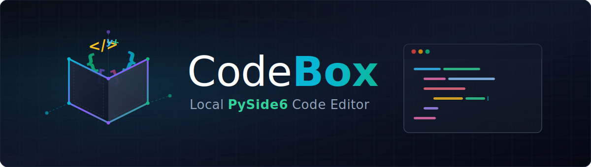

# CodeBox - lokaler PySide6-Desktop-Codeeditor

[](LICENSE)
[](https://www.python.org/)
[]()
[]()

[English](README.md) | Deutsch

CodeBox ist eine lokale Desktop-IDE für Windows-Entwickler, die einen leichten
PySide6-Codeeditor mit Tabs, Projektbaum, integriertem Terminal, Git-Hilfen,
Syntax-Highlighting und Language-Server-Diagnostics suchen.

## Schnelleinstieg

| Bedarf | Einstieg |
| --- | --- |
| Editor aus dem Quellcode starten | `pip install -r requirements.txt` und `python main.py` |
| Datei direkt öffnen | `python main.py --open pfad/zur/datei.py` |
| Lokale Windows-EXE bauen | `build_exe.bat` |
| Diagnostics oder Completion nutzen | Lokalen Language Server wie `python-lsp-server[all]` installieren |
| Roadmap verstehen | [DEVELOPMENT_PLAN.md](DEVELOPMENT_PLAN.md) |

## Warum CodeBox

- Local-first: Dateien bleiben auf dem eigenen Rechner, ohne Cloudkonto oder Telemetrie.
- PySide6-Desktop-Stack: native Windows-App mit kleiner Python-Codebasis.
- Mehrsprachiger Workflow: Python, JavaScript, TypeScript, C++, Rust, Go und Java.
- LSP-ready: Diagnostics und Completion können an installierte Language Server anbinden.
- Dev-bricks-Ökosystem: Begleiter zu PythonBox und DevCenter für kleine lokale Tools.

## Screenshot


## Funktionen

- Syntax-Highlighting für Python, JavaScript, TypeScript, C++, Rust, Go und Java
- Integriertes Terminal mit Shell-Auswahl und History
- Projekt-Dateibaum mit Filter und Kontextmenü
- Mehrere Tabs, Suchfunktion und Gehe-zu-Zeile
- Robuste Tab-Verwaltung mit Drag-and-drop-Reordering und Save-Failure-Guards
- Theme-System über `features/theme_manager.py`
- REST-API-/CLI-Grundlage für spätere Fernsteuerung
- LSP-Diagnostics und Completion-Anbindung für installierte Language Server

## Installation

```bash
git clone https://github.com/dev-bricks/CodeBox
cd CodeBox
pip install -r requirements.txt
python main.py
```

Alternativ startet `start.bat` die Anwendung unter Windows per Doppelklick.

### Voraussetzungen

- Python 3.10+
- PySide6 >= 6.5.0

### Optionale LSP-Server

- Python: `pip install "python-lsp-server[all]"` für Completion und Diagnostics
  (`pip install python-lsp-server` reicht nur für Completion)
- TypeScript: `npm install -g typescript-language-server`
- Rust: `rustup component add rust-analyzer`
- Go: `go install golang.org/x/tools/gopls@latest`
- C++: `clangd` über LLVM installieren

Der Python-LSP wird bevorzugt über `pylsp` auf `PATH` gestartet. Falls das
Script nicht auf `PATH` liegt, nutzt CodeBox den aktuellen Python-Interpreter
als Fallback mit `python -m pylsp`.

### Optionale Remote-Editing-Abhängigkeit

Die vorbereitete SSH/SFTP-Schicht nutzt `paramiko`, ist aber nicht für den
lokalen Editorstart erforderlich:

```bash
pip install paramiko
```

## Lokaler Windows-Build

```bat
build_exe.bat
```

Das Script nutzt PyInstaller und erstellt lokal eine `CodeBox.exe` mit
`CodeBox.ico`. Temporäre Build-Daten liegen unter
`C:\_Local_DEV\codex_build\codebox`, damit OneDrive den Build nicht sperrt.

## Suche und Abgrenzung

CodeBox sollte als lokaler PySide6-Codeeditor, Windows-Desktop-IDE,
Offline-Codeeditor, LSP-fähiger Python-Editor und leichtes mehrsprachiges
Entwicklerwerkzeug gesucht werden. Der Name kollidiert mit älteren Projekten
namens `codebox`; präzise Suchphrasen sind `dev-bricks CodeBox`,
`CodeBox PySide6`, `CodeBox LSP editor`, `CodeBox local desktop IDE` und
`PySide6 code editor with LSP diagnostics`.

## Status

Aktueller Stand: `DEV`, Version `0.1.0`.

Stabil nutzbar sind der mehrsprachige Editor, Projektbaum und Terminal,
Fenstertitel über `version.py`, Light-/Dark-Theme-Wechsel und robuste
Speichern-/Schließen-/Ausführen-Flows.

Offen für die nächste Ausbaustufe sind Runtime-Tests mit installiertem
LSP-Server, ein Linter-/Problems-Panel, ein Plugin-System für weitere Sprachen
und Remote Editing über SSH/SFTP.

## Datenschutz

CodeBox arbeitet lokal auf Dateien, die der Nutzer öffnet. Für den
Editor-Grundbetrieb werden keine Zugangsdaten benötigt und keine externen
Dienste kontaktiert, außer Sie starten selbst einen installierten Language
Server, externe Build-/Run-Tools oder optionale Remote-Editing-Funktionen.

Optionale Remote-Verbindungen können zur Laufzeit SSH-Passwörter oder
Schlüsselpfade verwenden. Solche Daten gehören nicht ins Repository und sollten
nur in lokalen, ignorierten Konfigurationsdateien oder im System-Keyring liegen.

Lokale Arbeitsdateien wie `AUFGABEN.txt`, `LOCK*.txt`, `.env`-Dateien,
Credentials, SSH-Schlüssel, Logs, Datenbanken und Build-Artefakte sind über
`.gitignore` ausgeschlossen.

## Lizenz

[MIT License](LICENSE)

## Haftung

Dieses Projekt ist eine unentgeltliche Open-Source-Schenkung im Sinne der
§§ 516 ff. BGB. Die Haftung des Urhebers ist gemäß § 521 BGB auf Vorsatz und
grobe Fahrlässigkeit beschränkt. Ergänzend gilt der Haftungsausschluss der
MIT-Lizenz.

Nutzung auf eigenes Risiko. Keine Wartungszusage, keine Verfügbarkeitsgarantie,
keine Gewähr für Fehlerfreiheit oder Eignung für einen bestimmten Zweck.
