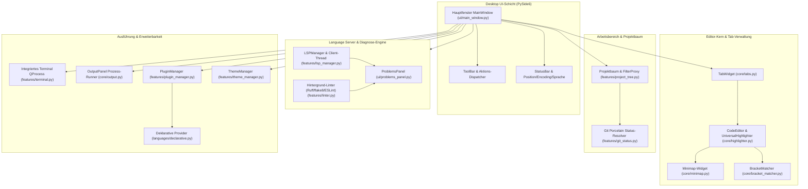
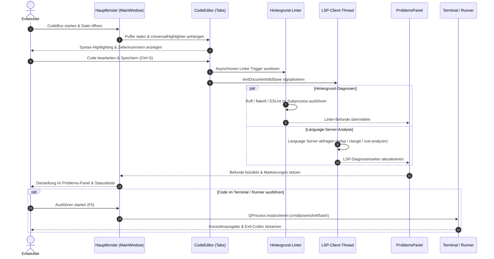

# CodeBox - Lokaler PySide6-Desktop-Codeeditor

[](LICENSE)
[](NOTICE)
[](https://www.python.org/)
[]()
[](https://github.com/dev-bricks/CodeBox/actions/workflows/ci.yml)
[]()
[](SECURITY.md)
[](SECURITY.md)
[](https://github.com/dev-bricks)
[](https://github.com/open-bricks)
[]()
[](CHANGELOG.md)
[](THIRD_PARTY_LICENSES.md)
[](llms.txt)
[](llms.txt)

[English](README.md) | Deutsch

CodeBox ist eine lokale Desktop-IDE für Windows-, Linux- und macOS-Entwickler, die einen leichtgewichtigen PySide6-Codeeditor mit Multi-Tab-Arbeitsbereich, Projektbaum, integriertem Terminal, Git-Porcelain-Statusanzeigen, Syntax-Highlighting, Language-Server-Protocol-Diagnosen (LSP) und einer erweiterbaren deklarativen JSON/Python-Plugin-Architektur suchen.

> [!NOTE]
> Für KI-Agenten und die automatisierte Erfassung steht unter [llms.txt](llms.txt) eine maschinenlesbare Übersicht mit Systemkontext, Architektur-Shortcuts und Modulreferenzen bereit.

---

## Schnellnavigation

- [1. Schnellstart](#schnellstart)
- [2. Systemarchitektur](#systemarchitektur)
- [3. End-to-End Workflow-Lebenszyklus](#end-to-end-workflow-lebenszyklus)
- [4. Kernfähigkeiten & Laufzeitinvarianten](#kernfaehigkeiten--laufzeitinvarianten)
- [5. Visuelle Demonstration](#visuelle-demonstration)
- [6. Zielgruppen & Anwendungsfälle](#zielgruppen--anwendungsfaelle)
- [7. Vergleichsmatrix gegenüber Alternativen](#vergleichsmatrix-gegenueber-alternativen)
- [8. Funktionsumfang](#funktionsumfang)
- [9. Installation & Schnellstart](#installation--schnellstart)
- [10. Language-Server-Protocol (LSP) Einrichtung](#lsp-einrichtung)
- [11. Deklaratives Plugin-System](#deklaratives-plugin-system)
- [12. Lokaler Windows-Build](#lokaler-windows-build)
- [13. Projektstruktur](#projektstruktur)
- [14. Geschwister-Ökosystem](#geschwister-oekosystem)
- [15. Suche & Abgrenzung](#suche--abgrenzung)
- [16. Drittanbieter-Lizenzen & Level 1 SBOM](#drittanbieter-lizenzen--level-1-sbom)
- [17. Sicherheit & Datenschutz](#sicherheit--datenschutz)
- [18. Lizenz & Haftung](#lizenz--haftung)

---

<a id="start-here"></a><a id="schnellstart"></a>
## Schnellstart

| Bedarf | Einstieg |
| --- | --- |
| Editor aus dem Quellcode starten | `pip install -r requirements.txt` und `python main.py` |
| Bestimmte Datei direkt öffnen | `python main.py --open pfad/zur/datei.py` |
| Plugins & Sprachen verwalten | `Ctrl+Shift+P` oder Menü *Bearbeiten -> Plugins & Sprachen...* |
| Tastenkürzel-Übersicht aufrufen | `F1` oder Menü *Hilfe -> Tastenkürzel-Übersicht* |
| Standalone Windows-EXE bauen | `build_exe.bat` |
| Diagnostics oder Completion nutzen | Lokalen Language Server wie `python-lsp-server[all]` installieren |
| Entwicklungsplan einsehen | [DEVELOPMENT_PLAN.md](DEVELOPMENT_PLAN.md) |
| Sicherheitsrichtlinie lesen | [SECURITY.md](SECURITY.md) |

---

<a id="system-architecture"></a><a id="systemarchitektur"></a>
## Systemarchitektur


```mermaid
flowchart TD
    subgraph UI ["Desktop UI-Schicht (PySide6)"]
        MW["Hauptfenster MainWindow (ui/main_window.py)"]
        TB["ToolBar & Aktions-Dispatcher"]
        ST["StatusBar & Position/Encoding/Sprache"]
        MW --> TB
        MW --> ST
    end

    subgraph Core ["Editor-Kern & Tab-Verwaltung"]
        Tabs["TabWidget (core/tabs.py)"]
        Ed["CodeEditor & UniversalHighlighter (core/highlighter.py)"]
        MM["Minimap-Widget (core/minimap.py)"]
        BM["BracketMatcher (core/bracket_matcher.py)"]
        Tabs --> Ed
        Ed --> MM
        Ed --> BM
    end

    subgraph Workspace ["Arbeitsbereich & Projektbaum"]
        PT["Projektbaum & FilterProxy (features/project_tree.py)"]
        Git["Git Porcelain Status-Resolver (features/git_status.py)"]
        PT --> Git
    end

    subgraph Diagnostics ["Language Server & Diagnose-Engine"]
        LSPMgr["LSPManager & Client-Thread (features/lsp_manager.py)"]
        Linter["Hintergrund-Linter (Ruff/flake8/ESLint) (features/linter.py)"]
        Prob["ProblemsPanel (ui/problems_panel.py)"]
        LSPMgr --> Prob
        Linter --> Prob
    end

    subgraph Runtime ["Ausführung & Erweiterbarkeit"]
        Term["Integriertes Terminal QProcess (features/terminal.py)"]
        Out["OutputPanel Prozess-Runner (core/output.py)"]
        PluginMgr["PluginManager (features/plugin_manager.py)"]
        Decl["Deklarative Provider (languages/declarative.py)"]
        Theme["ThemeManager (features/theme_manager.py)"]
        PluginMgr --> Decl
    end

    MW --> Tabs
    MW --> PT
    MW --> Diagnostics
    MW --> Term
    MW --> Out
    MW --> PluginMgr
    MW --> Theme
```

---

<a id="end-to-end-workflow-lifecycle"></a><a id="end-to-end-workflow-lebenszyklus"></a>
## End-to-End Workflow-Lebenszyklus


```mermaid
sequenceDiagram
    autonumber
    actor Dev as Entwickler
    participant UI as Hauptfenster (MainWindow)
    participant Ed as CodeEditor (Tabs)
    participant Linter as Hintergrund-Linter
    participant LSP as LSP-Client-Thread
    participant Prob as ProblemsPanel
    participant Term as Terminal / Runner

    Dev->>UI: CodeBox starten & Datei öffnen
    UI->>Ed: Puffer laden & UniversalHighlighter anhängen
    Ed-->>Dev: Syntax-Highlighting & Zeilennummern anzeigen

    Dev->>Ed: Code bearbeiten & Speichern (Ctrl+S)
    Ed->>Linter: Asynchronen Linter-Trigger auslösen
    Ed->>LSP: textDocument/didSave signalisieren

    par Hintergrund-Diagnosen
        Linter->>Linter: Ruff / flake8 / ESLint im Subprozess ausführen
        Linter-->>Prob: Linter-Befunde übermitteln
    and Language-Server-Analyse
        LSP->>LSP: Language Server abfragen (pylsp / clangd / rust-analyzer)
        LSP-->>Prob: LSP-Diagnosemarker aktualisieren
    end

    Prob-->>UI: Befunde bündeln & Markierungen setzen
    UI-->>Dev: Darstellung im Problems-Panel & Statusleiste

    opt Code im Terminal / Runner ausführen
        Dev->>UI: Ausführen starten (F5)
        UI->>Term: QProcess instanziieren (cmd/powershell/bash)
        Term-->>Dev: Konsolenausgabe & Exit-Codes streamen
    end
```

---

<a id="key-capabilities--runtime-invariants"></a><a id="kernfaehigkeiten--laufzeitinvarianten"></a>
## Kernfähigkeiten & Laufzeitinvarianten

| Fähigkeit / Prinzip | Technische Umsetzung | Garantie / Invariante |
| --- | --- | --- |
| **Local-First & Zero-Egress** | Editor-Kern, Highlighting, Plugins und Terminal arbeiten 100% offline. | Null Telemetrie, keinerlei externe Netzwerkaufrufe während des regulären Betriebs. |
| **Keine Admin-Rechte (User Mode)** | Läuft vollständig im unprivilegierten Benutzerkontext. | Keine UAC- oder Root-/Sudo-Eskalation erforderlich. |
| **Mehrsprachiges Highlighting** | Universelle Regex-Engine (`UniversalHighlighter`) mit Wortgrenzen-Escaping. | Python, JavaScript, TypeScript, C++, Rust, Go, Java und eigene Plugins. |
| **Erweiterbares Plugin-System** | Deklaratives JSON-Format (`plugins/*.json`) und dynamische Python-Klassen. | Hot-Reloading und automatische Erkennung ohne Ändern des Kernquellcodes. |
| **LSP-Diagnosen & Vervollständigung** | Threadsicherer Qt-Client mit Standard-Language-Servern über stdin/stdout. | Blockierungsfreie GUI; unterstützt pylsp, typescript-language-server, rust-analyzer, clangd, gopls. |
| **Hintergrund-Linting** | Asynchrone Ausführung lokaler Linter (Ruff, flake8, ESLint) beim Speichern. | Dynamische Bündelung von Warnungen und Fehlern im Problems-Panel. |
| **Schutz vor Speicherverlust** | Abgesicherte Dateisystemoperationen mit Puffererhaltung. | Tabs bleiben geöffnet und Daten geschützt, falls ein Schreibfehler auftritt. |
| **Integriertes Terminal** | Eingebetteter `QProcess`-Terminalbereich für `cmd`, `PowerShell` und `bash`. | Dynamische Kodierungsanpassung (cp1252 / utf-8) und Verzeichnissynchronisation. |
| **Multi-Root-Arbeitsbereiche** | Natives `.codebox-workspace`-Format mit relativen, portablen Pfaden. | Nahtlose Verwaltung mehrerer Projektordner in einer Instanz (`Ctrl+Shift+O`). |
| **Projektweite Dateisuche** | Multithreaded Hintergrund-Grep (`core/file_search.py`) mit `Ctrl+Shift+F`. | Schnelle, nicht-blockierende Suche mit Regex-, Wort- und Glob-Filtern. |
| **Definitionen- & Referenzen-Sprung** | LSP `textDocument/definition` & `references` (`F12`, `Shift+F12`) mit AST/Regex-Fallback. | Sofortige Symbolnavigation über geöffnete Tabs und Projektgrenzen hinweg. |
| **Aufgaben- & TODO-Seitenleiste** | Automatische Hintergrund-Erkennung (`core/todo_scanner.py`) für TODO, FIXME, BUG, HACK (`Ctrl+Alt+T`). | Schneller Direkt-Sprung, Gruppierung nach Datei/Tag und Echtzeit-Filterung. |


---

<a id="visual-showcase"></a><a id="visuelle-demonstration"></a>
## Visuelle Demonstration


*Abbildung 1: CodeBox-Arbeitsbereich mit Projektbaum, Multi-Tab-Editor, Syntax-Highlighting, integriertem Terminal und Diagnose-Panel.*

---

<a id="target-personas--use-cases"></a><a id="zielgruppen--anwendungsfaelle"></a>
## Zielgruppen & Anwendungsfälle

CodeBox wurde für datenschutzorientierte Entwickler, Systemingenieure und Autoren spezialisierter Entwicklertools konzipiert, die eine vollständig offlinefähige Desktop-IDE benötigen:

| Kennung | Zielgruppe & Persona | Kernanforderung & Herausforderung | Lösungsansatz von CodeBox | Relevante Suchanfragen (High-Intent) |
|---|---|---|---|---|
| **[PERSONA-01]** | **Local-First & Offline-Entwickler** | Frustriert über erzwungene Cloud-Anmeldungen, Telemetrie-Egress und unbemerkte Netzwerkverbindungen moderner Editoren. | 100% offlinefähige Zero-Egress-Laufzeit (`INV-LOCAL-01`). Keine Remote-Telemetrie, keine Cloud-Abhängigkeiten, rein lokale Ausführung. | `local-first code editor`, `zero-egress python IDE`, `offline code editor windows` |
| **[PERSONA-02]** | **Desktop- & System-Ingenieure** | Träge Electron-basierte IDEs mit Gigabytes an RAM-Verbrauch und 10+ Sekunden Startzeit bei Multi-Projekt-Setups. | Native PySide6 / C++ Qt Engine mit Kaltstart unter 1 Sekunde, minimalem Speicher-Footprint und Multi-Shell-Terminal (`INV-PERF-02`, `INV-TERM-06`). | `lightweight desktop IDE python`, `fast python code editor`, `pyside6 code editor` |
| **[PERSONA-03]** | **Sicherheits- & Compliance-Verantwortliche** | Benötigen lückenlose Supply-Chain-Transparenz, unprivilegierten Nutzermodus, Zero-Copyleft-Isolation und definierte Reaktions-SLAs. | RunAsInvoker-Ausführung ohne Adminrechte (`INV-NOELEV-02`), Level 1 SBOM mit dynamischer LGPL-3.0-Isolation (`INV-LGPL-03`) und 48h Sicherheits-SLA (`INV-SLA-10`). | `secure offline editor SBOM`, `MIT code editor zero copyleft`, `enterprise compliant desktop IDE` |
| **[PERSONA-04]** | **DSL- & Tooling-Autoren** | Komplexe Erweiterungsmodelle klassischer IDEs verlangen Kompilierung, Bundling und Konten in proprietären Marktplätzen. | Deklaratives JSON-Pluginsystem (`INV-PLUG-07`) für benutzerdefiniertes Syntax-Highlighting, Kommentarregeln und Auto-Pairing mit Hot-Reloading. | `declarative language editor plugin`, `custom dsl syntax highlighter`, `json language definition ide` |

---

<a id="comparative-matrix-vs-alternatives"></a><a id="vergleichsmatrix-gegenueber-alternativen"></a>
## Vergleichsmatrix gegenüber Alternativen

Die folgende Matrix vergleicht CodeBox mit 4 verbreiteten Entwicklungsumgebungen entlang 10 technischer Kerninvarianten:

| Technische Invariante | CodeBox (dev-bricks) | VS Code / VSCodium | Sublime Text | PyCharm Community | Schlanke CLI (Micro/Nano) |
|---|---|---|---|---|---|
| **INV-LOCAL-01: 100% Zero-Egress** | **Native Garantie** (Keine Telemetrie, voll offline) | Teilweise / Manuelles Telemetrie-Opt-Out nötig | Nativ (Kommerziell Closed-Source) | Telemetrie-Opt-Out erforderlich | Nativ (Reines Terminal) |
| **INV-PERF-02: Kaltstart & Speicher** | **<1,0s Kaltstart** (Natives PySide6/Qt) | Schwer (Electron / Chromium RAM-Last) | Sehr schnell (Proprietäres C++) | Träge (JVM-Speicherbedarf) | Unmittelbar |
| **INV-LGPL-03: Zero-Copyleft-Isolation** | **Permissiv / Dynamische LGPL** | Gemischt MIT / Proprietärer Marktplatz | Proprietäre Lizenz | Apache 2.0 | GPL-3.0 (Copyleft) |
| **INV-CRASH-04: Schutz vor Datenverlust** | **Geschützte Puffer** (Tabs bleiben bei Schreibfehler) | Ja | Ja | Ja | Anfällig bei Terminal-Abbruch |
| **INV-LSP-05: Asynchrone LSP-Engine** | **Threadsicherer Qt-Client** (`pylsp`, `clangd` etc.) | First-Class LSP Standard | Über LSP-Plugin | Integriertes eigenes Indexing | Keine / Externe Wrapper |
| **INV-TERM-06: Eingebettetes Multi-Shell** | **`QProcess`-Terminal** (cmd/PowerShell/bash) | Integriertes xterm.js | Keine (Externes Terminal) | Integriertes Terminal | Native Shell-Umgebung |
| **INV-PLUG-07: Deklarative JSON-Plugins** | **Sofortige JSON-Schemas** (Keine Kompilierung) | TypeScript Extension Bundle | Python-Skripte / Pakete | Java / Kotlin Plugins | Konfigurationsdateien |
| **INV-PORT-08: Multi-Root-Workspaces** | **`.codebox-workspace`** (Relative portable Pfade) | `.code-workspace` | `.sublime-project` | `.idea` Projektordner | Verzeichnisargumente |
| **INV-GIT-09: Git Porcelain & Diff-Viewer** | **Porcelain-Status + Unified Diff** | Umfangreiche Git-Integration | Basis Git-Badges | Umfangreiche Git-Integration | CLI Git-Befehle |
| **INV-SLA-10: 48h Sicherheits-SLA & § 521 BGB** | **Formales SLA + § 521 BGB Hinweis** | Community-Triage | Herstellersupport | JetBrains Tracker | Best Effort |

---

<a id="features"></a><a id="funktionsumfang"></a>
## Funktionsumfang

- **Projektweite Dateisuche (Find in Files / Grep-Tool)**: Schnelle Textsuche über alle Projektordner und Dateien (`Ctrl+Shift+F`) mit regulären Ausdrücken, Groß-/Kleinschreibung, Ganzwort-Suche, Glob-Filtern (Einschließen/Ausschließen), asynchronem Hintergrund-Worker und Direktsprung in den Editor.
- **Multi-Root-Arbeitsbereiche**: Verwaltung mehrerer Projektordner in einer gemeinsamen Instanz mit dem `.codebox-workspace`-Format und portablen relativen Pfaden (`Ctrl+Shift+O`).
- **Schnellauswahl & Befehlspalette**: Schneller Datei-Finder (`Ctrl+P`) mit intelligentem Treffer-Scoring und interaktive Befehlspalette (`Ctrl+Shift+P`) zur tastaturgesteuerten IDE-Bedienung.
- **Git-Staging & Commit-Dialog**: Integriertes Git-Staging (`git add`, `git restore --staged`), Verwerfen von Änderungen, Diff-Inspektion und nativer Commit-Dialog (`Ctrl+Alt+C`) direkt aus der Seitenleiste und dem Ansicht-Menü.
- **Integrierter Git Diff-Viewer**: Side-by-Side- und Unified-Diffs direkt in der IDE (`Ctrl+Alt+D`).
- **Multi-Cursor & Column Selection**: Synchrone Bearbeitung an beliebig vielen Cursor-Positionen, Spaltenauswahl (`Alt+Shift+Ziehen`), Vorkommen-Markierung (`Ctrl+Shift+L` / `Ctrl+Alt+L`) und atomares Undo/Redo.
- **Code-Faltung & Split-Editor**: Interaktives Ein-/Ausklappen von Funktionsblöcken und horizontale/vertikale Editor-Teilung mit synchronisierten Dokument-Buffern.
- **Präzises Syntax-Highlighting**: Vorkonfigurierte Highlightings für Python, JavaScript, TypeScript, C++, Rust, Go und Java mit satzzeichensicherem Wortgrenzen-Matching.
- **Deklarative Plugin-Architektur**: Neue Sprachen in wenigen Minuten per JSON-Schema definieren (`plugins/`, `~/.codebox/plugins/`).
- **Interaktive Verwaltungsdialoge**: Vollständige GUI-Dialoge zur Verwaltung von Sprach-Plugins und Tastaturkürzeln (`F1`).
- **Integriertes Terminal**: Native Terminalemulation mit Befehlshistorie, Streaming und automatischer Pfadsynchronisation.
- **Projekt-Dateibaum**: Baumansicht mit Proxy-Suchfilter, Kontextaktionen und Git-Porcelain-Statusmarkern.
- **Multi-Tab-Arbeitsbereich**: Drag-and-Drop-Reiter, Schutz vor Speicherverlust und absolute Pfad-Tooltips.
- **Minimap-Vorschau & Navigation**: Synchronisierte Code-Minimap, Klammer-Autovervollständigung und Gehe-zu-Zeile (`Ctrl+G`).
- **Duales Designsystem**: Nahtloser Wechsel zwischen Dark- und Light-Theme über `features/theme_manager.py`.
- **LSP-Diagnosen & Code-Completion**: Asynchrone Hintergrundabfragen für Echtzeitdiagnosen und Vervollständigungen.
- **Automatisierte Linter**: Ruff-, flake8- und ESLint-Integration direkt beim Speichern mit Übernahme ins Problems-Panel.

---

<a id="installation--quickstart"></a><a id="installation--schnellstart"></a>
## Installation & Schnellstart

```bash
# Repository klonen
git clone https://github.com/dev-bricks/CodeBox.git
cd CodeBox

# Abhängigkeiten installieren
pip install -r requirements.txt

# CodeBox starten
python main.py
```

Unter Windows kann CodeBox auch einfach per Doppelklick auf `start.bat` gestartet werden.

### Systemvoraussetzungen

- **Python**: 3.10, 3.11, 3.12 oder 3.13
- **GUI-Framework**: PySide6 >= 6.5.0
- **Betriebssysteme**: Windows 10/11, POSIX Linux (Ubuntu, Debian, Fedora), macOS

---

<a id="language-server-protocol-lsp-setup"></a><a id="lsp-einrichtung"></a>
## Language-Server-Protocol (LSP) Einrichtung

CodeBox bindet direkt an installierte System-Language-Server an:

| Sprache | Empfohlener Language Server | Installationsbefehl |
| --- | --- | --- |
| **Python** | `python-lsp-server` (pylsp) | `pip install "python-lsp-server[all]"` |
| **TypeScript / JS** | `typescript-language-server` | `npm install -g typescript-language-server typescript` |
| **Rust** | `rust-analyzer` | `rustup component add rust-analyzer` |
| **Go** | `gopls` | `go install golang.org/x/tools/gopls@latest` |
| **C / C++** | `clangd` | LLVM / Clang Paket installieren |

CodeBox bevorzugt Server auf dem System-`PATH` und nutzt in virtuellen Umgebungen automatisch `python -m pylsp` als Fallback.

---

<a id="declarative-plugin-system"></a><a id="deklaratives-plugin-system"></a>
## Deklaratives Plugin-System

Eigene Sprachdefinitionen werden durch Ablegen einer JSON-Datei in `plugins/` oder `~/.codebox/plugins/` registriert:

```json
{
  "name": "CustomLang",
  "version": "1.0.0",
  "extensions": [".custom", ".cst"],
  "keywords": ["function", "end", "if", "then", "else", "return"],
  "comment_style": ["#"],
  "auto_close_pairs": {
    "(": ")",
    "[": "]",
    "{": "}"
  }
}
```

Die Plugins können zur Laufzeit im Plugin-Manager (`Ctrl+Shift+P`) neu geladen werden.

---

<a id="local-windows-build"></a><a id="lokaler-windows-build"></a>
## Lokaler Windows-Build

Eigenständige, installationsfreie Windows-Executable kompilieren:

```bat
build_exe.bat
```

Das Script nutzt PyInstaller mit `CodeBox.spec`, um Icons, Themes und deklarative Plugins in `dist\CodeBox.exe` zu bündeln.

---

<a id="project-structure"></a><a id="projektstruktur"></a>
## Projektstruktur

```text
CodeBox/
├── main.py                  # Anwendungseinstiegspunkt & CLI-Parameter
├── version.py               # Zentrale Versionskonstanten & Fenstertitel-Formatierung
├── pyproject.toml           # PEP 621 Metadaten & Pytest-Konfiguration
├── requirements.txt         # Laufzeitabhängigkeiten (PySide6)
├── core/                    # Editor-Tabs, Highlighter, Minimap, Output-Panel
├── features/                # Terminal, Projektbaum, LSP-Manager, Linter, Themes, Plugins
├── languages/               # Sprachdefinitionen, Provider und deklarativer Parser
├── ui/                      # MainWindow-Layout, Einstellungs-, Shortcuts- und Plugin-Dialoge
├── plugins/                 # Gebündelte deklarative Sprach-Plugins (JSON)
├── themes/                  # QSS-Stylesheets (dark.qss, light.qss)
├── assets/                  # Hochauflösende Vektorbanner und Icons
├── tests/                   # Automatisierte Testsuite (295+ Tests)
└── README/screenshots/      # Grafiken für den Projektauftritt
```

---

<a id="sibling-ecosystem"></a><a id="geschwister-oekosystem"></a>
## Geschwister-Ökosystem

CodeBox ist Teil des Entwickler-Ökosystems von **dev-bricks** und **ellmos-ai** unter dem Dach von **open-bricks**:

| Repository | Schwerpunkt | Ökosystem |
| --- | --- | --- |
| [dev-bricks/safe-start-for-codex](https://github.com/dev-bricks/safe-start-for-codex) | Startup-Gating für lokale Codex-Automationen | `dev-bricks` |
| [dev-bricks/companion-for-agy](https://github.com/dev-bricks/companion-for-agy) | Node.js Orchestrierungs-Wrapper für Antigravity | `dev-bricks` |
| [dev-bricks/automation-master](https://github.com/dev-bricks/automation-master) | Task-Orchestrierung und Automations-Supervisor | `dev-bricks` |
| [dev-bricks/automizer-for-claude-desktop](https://github.com/dev-bricks/automizer-for-claude-desktop) | Automationsbrücke für Claude Desktop | `dev-bricks` |
| [ellmos-ai/ellmos-codecommander-mcp](https://github.com/ellmos-ai/ellmos-codecommander-mcp) | AST-Analyse, Refactoring und Code-Diagnose MCP-Server | `ellmos-ai` |
| [ellmos-ai/ellmos-filecommander-mcp](https://github.com/ellmos-ai/ellmos-filecommander-mcp) | Dateisystem-Manipulation & Prozess-Supervisor MCP | `ellmos-ai` |
| [doc-bricks/CleanMarkdown](https://github.com/doc-bricks/CleanMarkdown) | Moderner ablenkungsfreier Markdown-Desktop-Editor | `doc-bricks` |
| [file-bricks/ExplorerPro](https://github.com/file-bricks/ExplorerPro) | Lokaler Multi-Tab Desktop-Dateimanager | `file-bricks` |
| [open-bricks/.github](https://github.com/open-bricks/.github) | Dachorganisation und Open-Source-Standards | `open-bricks` |

---

<a id="search--disambiguation"></a><a id="suche--abgrenzung"></a>
## Suche & Abgrenzung

Präzise Suchbegriffe zur eindeutigen Auffindbarkeit:

- `dev-bricks CodeBox`
- `CodeBox PySide6 Desktop IDE`
- `Lokaler Codeeditor Python Windows`
- `PySide6 Codeeditor mit LSP Diagnosen`
- `Offline Python IDE Language Server Protocol`
- `CodeBox deklaratives Sprach-Plugin-System`

---

<a id="third-party-licenses--level-1-sbom"></a><a id="drittanbieter-lizenzen--level-1-sbom"></a>
## Drittanbieter-Lizenzen & Level 1 SBOM

CodeBox wird unter der permissiven MIT-Lizenz bereitgestellt. Sämtliche Drittanbieter-Abhängigkeiten, Lizenztexte und Sicherheitsinvarianten sind auditiert und dokumentiert:

- **Level 1 SBOM:** [`THIRD_PARTY_LICENSES.md`](THIRD_PARTY_LICENSES.md) (Auditiert 2026-09-23)
- **Komponenten-Textinventar:** [`THIRD_PARTY_LICENSES.txt`](THIRD_PARTY_LICENSES.txt)
- **Rechtlicher Hinweis & Urheberrecht:** [`NOTICE`](NOTICE)
- **Zero-Copyleft-Garantie:** PySide6 wird über offizielle PyPI-Wheels gemäß LGPL-3.0 § 4 dynamisch eingebunden. Alle mitgelieferten Sprach-Plugins und Kernmodule unterliegen permissiven Lizenzen.

---

<a id="security--privacy"></a><a id="sicherheit--datenschutz"></a>
## Sicherheit & Datenschutz

CodeBox unterliegt verbindlichen Sicherheits- und Datenschutzvorgaben. Vollständige Richtlinie in [SECURITY.md](SECURITY.md):

- **100% Offline-Betrieb (`INV-LOCAL-01`)**: Kein Tracking, keine Telemetrie oder ungefragte Datenübertragung.
- **Unprivilegierter Modus (`INV-NOELEV-02`)**: Läuft vollständig mit normalen Benutzerrechten (RunAsInvoker).
- **48-Stunden-Reaktions-SLA (`INV-SLA-10`)**: Jede gemeldete Sicherheitslücke erhält innerhalb von 48 Stunden eine erste Triage.
- **Vertrauliche Meldungen**: Schwachstellen bitte vertraulich über [GitHub Security Advisories](https://github.com/dev-bricks/CodeBox/security/advisories/new) oder per E-Mail an `security@ellmos.ai` und `lukas@open-bricks.org` melden.

---

<a id="license--liability"></a><a id="lizenz--haftung"></a>
## Lizenz & Haftung

Dieses Projekt ist unter der [MIT-Lizenz](LICENSE) lizenziert. Die formale Namensnennung ist in [`NOTICE`](NOTICE) hinterlegt.

### Gesetzliche Haftungsbeschränkung (§ 521 BGB)

Dieses Projekt ist eine unentgeltliche Open-Source-Schenkung im Sinne der §§ 516 ff. BGB. Die Haftung des Urhebers ist gemäß § 521 BGB auf Vorsatz und grobe Fahrlässigkeit beschränkt. Ergänzend gilt der Haftungsausschluss der MIT-Lizenz. Nutzung auf eigenes Risiko. Keine Wartungszusage oder Gewährleistung für einen bestimmten Einsatzzweck.
